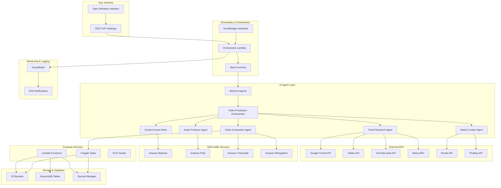
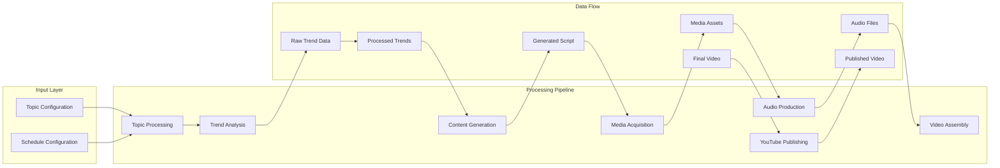

# Design Document

## Overview

The Automated Video Pipeline is a serverless, event-driven architecture built on AWS that leverages AI agents and GenAI services to create, produce, and publish high-quality videos automatically. The system uses a multi-agent orchestration pattern with Amazon Bedrock Agents coordinating specialized AI agents for trend analysis, content creation, media curation, and video production.

## Architecture

### High-Level Architecture Diagram



### Detailed Component Architecture



## Components and Interfaces

### 1. Topic Management Service

**AWS Services:** API Gateway, Lambda, DynamoDB
**Purpose:** Manages user-defined topics and scheduling preferences

**Interface:**
```json
{
  "topicId": "string",
  "topic": "investing in real estate in Canada",
  "keywords": ["real estate", "Canada", "investment", "property"],
  "priority": 1,
  "scheduledTime": "2025-01-15T14:00:00Z",
  "status": "pending|processing|completed|failed"
}
```

### 2. AI Agent Orchestration Layer

**AWS Services:** Amazon Bedrock Agents, Lambda, Step Functions
**Purpose:** Coordinates multi-agent workflows and manages agent communication

**Agent Hierarchy:**
- **Supervisor Agent:** Video Production Orchestrator
- **Collaborator Agents:** 
  - Trend Research Analyst
  - Content Script Writer  
  - Media Curator
  - Audio Producer
  - Video Compositor & Publisher

### 3. Trend Analysis Service

**AWS Services:** Lambda, DynamoDB, S3, Amazon Bedrock
**External APIs:** Google Trends, Twitter API, YouTube Data API, News APIs

**Data Processing Flow:**
1. Parallel API calls to trend sources
2. Raw data storage in S3 (partitioned by date/topic)
3. Structured metrics in DynamoDB
4. AI analysis using Bedrock for trend summarization

### 4. Content Generation Service

**AWS Services:** Amazon Bedrock, Lambda, S3
**Purpose:** Creates video scripts, narration, and SEO content

**Script Structure:**
```json
{
  "scriptId": "string",
  "topic": "string",
  "duration": 480,
  "scenes": [
    {
      "sceneId": 1,
      "duration": 60,
      "narration": "string",
      "visualRequirements": ["keyword1", "keyword2"],
      "timing": {
        "start": 0,
        "end": 60
      }
    }
  ],
  "seoMetadata": {
    "title": "string",
    "description": "string",
    "tags": ["tag1", "tag2"]
  }
}
```

### 5. Media Acquisition Service

**AWS Services:** Lambda, S3
**External APIs:** Pexels API, Pixabay API

**Media Asset Structure:**
```json
{
  "assetId": "string",
  "type": "image|video",
  "url": "string",
  "s3Location": "string",
  "keywords": ["keyword1", "keyword2"],
  "duration": 30,
  "resolution": "1920x1080",
  "license": "free"
}
```

### 6. Audio Production Service

**AWS Services:** Amazon Polly, Lambda, S3

**Audio Configuration:**
- Voice: Neural voices (Joanna, Matthew, or custom)
- Format: MP3, 44.1kHz, 128kbps
- Speech marks for timing synchronization
- SSML support for emphasis and pacing

### 7. Video Production Service

**AWS Services:** ECS Fargate, Lambda, S3, Amazon Transcribe, Amazon Rekognition

**FFmpeg Processing Pipeline:**
1. Asset preparation and validation
2. Audio-visual synchronization using speech marks
3. Subtitle generation and embedding
4. Quality validation with Rekognition
5. Final rendering and compression

### 8. YouTube Publishing Service

**AWS Services:** Lambda, Secrets Manager, DynamoDB
**External API:** YouTube Data API v3

**Publishing Workflow:**
1. OAuth 2.0 authentication
2. Video upload with metadata
3. Thumbnail upload (optional)
4. Status tracking and logging

### 9. Cost Tracking Service

**AWS Services:** Lambda, DynamoDB, CloudWatch, Cost Explorer API
**Purpose:** Tracks detailed costs for each video generation

**Cost Tracking Components:**
```json
{
  "costTracker": {
    "videoId": "string",
    "startTime": "timestamp",
    "endTime": "timestamp",
    "services": {
      "lambda": {
        "invocations": "number",
        "durationMs": "number",
        "memoryMb": "number",
        "cost": "number"
      },
      "fargate": {
        "taskDurationMs": "number",
        "cpuUnits": "number",
        "memoryMb": "number",
        "cost": "number"
      },
      "s3": {
        "storageBytes": "number",
        "requests": "number",
        "dataTransferBytes": "number",
        "cost": "number"
      },
      "dynamodb": {
        "readUnits": "number",
        "writeUnits": "number",
        "storageBytes": "number",
        "cost": "number"
      },
      "bedrock": {
        "inputTokens": "number",
        "outputTokens": "number",
        "modelInvocations": "number",
        "cost": "number"
      },
      "polly": {
        "charactersProcessed": "number",
        "neuralVoiceUsage": "boolean",
        "cost": "number"
      }
    },
    "externalApiCosts": {
      "totalApiCalls": "number",
      "estimatedCost": "number"
    }
  }
}
```

## Data Models

### Topic Configuration Table (DynamoDB)

```json
{
  "PK": "TOPIC#<topicId>",
  "SK": "CONFIG",
  "topicId": "string",
  "topic": "string",
  "keywords": ["string"],
  "priority": "number",
  "schedule": {
    "frequency": "daily|weekly",
    "times": ["14:00", "18:00", "22:00"]
  },
  "createdAt": "timestamp",
  "updatedAt": "timestamp"
}
```

### Trend Data Table (DynamoDB)

```json
{
  "PK": "TREND#<date>",
  "SK": "TOPIC#<topicId>",
  "topicId": "string",
  "source": "google|twitter|youtube|news",
  "trendScore": "number",
  "sentiment": "positive|negative|neutral",
  "keywords": ["string"],
  "summary": "string",
  "rawDataS3": "string",
  "timestamp": "timestamp"
}
```

### Video Production Table (DynamoDB)

```json
{
  "PK": "VIDEO#<videoId>",
  "SK": "METADATA",
  "videoId": "string",
  "topicId": "string",
  "status": "pending|processing|completed|failed|published",
  "scriptS3": "string",
  "audioS3": "string",
  "videoS3": "string",
  "youtubeUrl": "string",
  "seoMetadata": {
    "title": "string",
    "description": "string",
    "tags": ["string"]
  },
  "processingTime": "number",
  "createdAt": "timestamp",
  "publishedAt": "timestamp",
  "costTracking": {
    "totalCost": "number",
    "costBreakdown": {
      "lambdaExecutionCost": "number",
      "fargateComputeCost": "number",
      "s3StorageCost": "number",
      "dynamodbCost": "number",
      "bedrockApiCost": "number",
      "pollyAudioCost": "number",
      "transcribeSubtitleCost": "number",
      "rekognitionAnalysisCost": "number",
      "externalApiCosts": {
        "googleTrends": "number",
        "twitter": "number",
        "youtube": "number",
        "pexels": "number",
        "pixabay": "number",
        "news": "number"
      }
    },
    "resourceUsage": {
      "lambdaInvocations": "number",
      "lambdaDurationMs": "number",
      "fargateTaskDurationMs": "number",
      "s3StorageBytes": "number",
      "s3Requests": "number",
      "dynamodbReadUnits": "number",
      "dynamodbWriteUnits": "number",
      "bedrockTokensUsed": "number",
      "pollyCharactersProcessed": "number",
      "transcribeMinutesProcessed": "number",
      "rekognitionImagesAnalyzed": "number"
    },
    "costPerMinute": "number",
    "estimatedMonthlyProjection": "number"
  }
}
```

### Cost Tracking Table (DynamoDB)

```json
{
  "PK": "COST#<date>",
  "SK": "SUMMARY",
  "date": "string",
  "totalDailyCost": "number",
  "videosGenerated": "number",
  "averageCostPerVideo": "number",
  "costBreakdownByService": {
    "lambda": "number",
    "fargate": "number",
    "s3": "number",
    "dynamodb": "number",
    "bedrock": "number",
    "polly": "number",
    "transcribe": "number",
    "rekognition": "number",
    "externalApis": "number"
  },
  "monthlyProjection": "number",
  "costOptimizationSuggestions": ["string"],
  "createdAt": "timestamp"
}
```

### S3 Bucket Structure

```
automated-video-pipeline/
├── raw-data/
│   ├── trends/
│   │   └── {date}/{source}/{topicId}.json
│   └── media/
│       └── {topicId}/{assetId}.{ext}
├── processed/
│   ├── scripts/
│   │   └── {videoId}/script.json
│   ├── audio/
│   │   └── {videoId}/audio.mp3
│   └── videos/
│       └── {videoId}/final.mp4
└── archives/
    └── {year}/{month}/
```

## Error Handling

### Retry Strategy

**Lambda Functions:**
- Exponential backoff: 1s, 2s, 4s, 8s, 16s
- Maximum retries: 3
- Dead letter queue for failed executions

**External API Calls:**
- Circuit breaker pattern
- Fallback to cached data when available
- Rate limiting compliance

**Video Processing:**
- Checkpoint-based recovery for long-running tasks
- Alternative media asset selection on processing failure
- Quality validation with automatic re-processing

### Error Categories

1. **Transient Errors:** Network timeouts, API rate limits
2. **Data Errors:** Invalid media formats, corrupted files
3. **Business Logic Errors:** Insufficient trend data, topic validation failures
4. **System Errors:** Service unavailability, resource limits

## Testing Strategy

### Unit Testing
- Lambda function logic testing
- AI agent prompt validation
- Data model validation
- API integration mocking

### Integration Testing
- End-to-end pipeline testing with test topics
- External API integration validation
- AWS service integration testing
- Agent communication testing

### Performance Testing
- Video processing time benchmarks
- Concurrent pipeline execution
- Resource utilization monitoring
- Cost optimization validation

### Quality Assurance
- Video output quality validation
- Audio synchronization testing
- Subtitle accuracy verification
- SEO metadata effectiveness

## Security Considerations

### Authentication & Authorization
- IAM roles with least privilege access
- API Gateway with API keys and throttling
- OAuth 2.0 for YouTube API access
- Secrets Manager for API credentials

### Data Protection
- S3 bucket encryption at rest
- DynamoDB encryption
- VPC endpoints for internal communication
- CloudTrail for audit logging

### Network Security
- Private subnets for compute resources
- Security groups with minimal required access
- WAF protection for API Gateway
- VPC Flow Logs for network monitoring

## Scalability & Performance

### Auto Scaling Configuration
- Lambda concurrent execution limits
- ECS Fargate auto-scaling based on CPU/memory
- DynamoDB on-demand scaling
- S3 request rate optimization

### Performance Optimizations
- CloudFront for media asset delivery
- ElastiCache for frequently accessed data
- Parallel processing for independent tasks
- Batch processing for bulk operations

### Cost Optimization
- S3 lifecycle policies (Standard → IA → Glacier)
- Fargate Spot instances for non-critical tasks
- Reserved capacity for predictable workloads
- Lambda provisioned concurrency for consistent performance