# Design Document

## Overview

The Automated Video Pipeline is a serverless, event-driven architecture built on AWS that leverages AI agents and GenAI services to create, produce, and publish high-quality videos automatically. The system uses a multi-agent orchestration pattern with Amazon Bedrock Agents coordinating specialized AI agents for trend analysis, content creation, media curation, and video production.

## Storage Configuration

### S3 Bucket Infrastructure

**Primary Bucket**: `automated-video-pipeline-786673323159-us-east-1`

- **Purpose**: Main storage for all video pipeline assets
- **Structure**:
  ```
  automated-video-pipeline-786673323159-us-east-1/
  ├── trends/                    # Raw trend data by date
  ├── scripts/                   # Generated video scripts
  ├── media/                     # Downloaded assets from Pexels/Pixabay
  ├── audio/                     # Generated audio files
  ├── final-videos/              # Completed videos
  └── archives/                  # Manual archive storage
  ```

**Backup Bucket**: `automated-video-pipeline-backup-786673323159-us-west-2`

- **Purpose**: Cross-region backup and disaster recovery
- **Location**: US West 2 (Oregon) for geographic redundancy

### Lifecycle Policy - Simplified Cost Management

**Auto-Delete After 7 Days**:

```json
{
  "Rules": [
    {
      "ID": "AutoDeleteAfter7Days",
      "Status": "Enabled",
      "Filter": { "Prefix": "" },
      "Expiration": { "Days": 7 },
      "AbortIncompleteMultipartUpload": { "DaysAfterInitiation": 1 }
    }
  ]
}
```

**Benefits**:

- **Cost Optimization**: No storage costs after 7 days
- **Simplicity**: No complex storage class transitions
- **YouTube Focus**: Videos are published to YouTube, S3 is temporary storage
- **Clean Environment**: Automatic cleanup prevents storage bloat

**Tagging Strategy**:

```json
{
  "Project": "automated-video-pipeline",
  "Service": "video-content-generation",
  "Environment": "production",
  "CostCenter": "content-creation",
  "Owner": "video-automation-team",
  "ManagedBy": "manual",
  "BackupRequired": "true",
  "DataClassification": "internal"
}
```

## Architecture

### High-Level Architecture Diagram

```mermaid
graph TB
    subgraph "User Interface"
        UI[Topic Definition Interface]
        API[REST API Gateway]
    end

    subgraph "Scheduling & Orchestration"
        EB[EventBridge Scheduler]
        SF[Step Functions]
        ORCH[Orchestrator Lambda]
    end

    subgraph "AI Agent Layer"
        BA[Bedrock Agents]
        SUPER[Video Production Orchestrator]
        TREND[Trend Research Agent]
        SCRIPT[Content Script Writer]
        MEDIA[Media Curator Agent]
        AUDIO[Audio Producer Agent]
        VIDEO[Video Compositor Agent]
    end

    subgraph "External APIs"
        GT[Google Trends API]
        TW[Twitter API]
        YT[YouTube Data API]
        NEWS[News APIs]
        PX[Pexels API]
        PB[Pixabay API]
    end

    subgraph "AWS AI/ML Services"
        BR[Amazon Bedrock]
        POL[Amazon Polly]
        TR[Amazon Transcribe]
        REK[Amazon Rekognition]
    end

    subgraph "Compute Services"
        LAM[Lambda Functions]
        FAR[Fargate Tasks]
        ECS[ECS Cluster]
    end

    subgraph "Storage & Database"
        S3[S3 Buckets]
        DDB[DynamoDB Tables]
        SM[Secrets Manager]
    end

    subgraph "Monitoring & Logging"
        CW[CloudWatch]
        SNS[SNS Notifications]
    end

    UI --> API
    API --> ORCH
    EB --> ORCH
    ORCH --> SF
    SF --> BA
    BA --> SUPER
    SUPER --> TREND
    SUPER --> SCRIPT
    SUPER --> MEDIA
    SUPER --> AUDIO
    SUPER --> VIDEO

    TREND --> GT
    TREND --> TW
    TREND --> YT
    TREND --> NEWS

    SCRIPT --> BR
    AUDIO --> POL
    VIDEO --> TR
    VIDEO --> REK

    MEDIA --> PX
    MEDIA --> PB

    LAM --> S3
    LAM --> DDB
    FAR --> S3

    VIDEO --> FAR
    ORCH --> CW
    CW --> SNS

    LAM --> SM
    FAR --> SM
```



### Detailed Component Architecture


## Topic Management System

### Overview

The Topic Management System provides a comprehensive solution for defining, organizing, and synchronizing video topics. It supports both direct API management and Google Sheets integration for user-friendly topic configuration.

### Architecture Components

#### 1. Topic Management Lambda Function

**Purpose**: Handles CRUD operations for video topics with validation and priority-based scheduling.

**Key Features**:
- **Node.js 20.x Runtime**: AWS compliant runtime for optimal performance
- **Comprehensive Validation**: Input validation with detailed error messages
- **Keyword Extraction**: Automatic keyword generation from topic text
- **Priority Scheduling**: Support for priority levels 1-10 for execution order
- **Error Handling**: Detailed error responses with request tracking

**Data Model**:
```json
{
  "topicId": "uuid",
  "topic": "Investing for beginners in the USA",
  "keywords": ["investing", "beginners", "usa"],
  "dailyFrequency": 2,
  "priority": 1,
  "status": "active",
  "targetAudience": "beginners",
  "region": "US",
  "contentStyle": "engaging_educational",
  "createdAt": "2025-01-15T10:00:00.000Z",
  "updatedAt": "2025-01-15T10:00:00.000Z",
  "lastProcessed": null,
  "totalVideosGenerated": 0,
  "averageEngagement": 0,
  "metadata": {
    "createdBy": "user",
    "source": "api",
    "tags": ["investing", "finance"]
  }
}
```

#### 2. Google Sheets Integration Service

**Purpose**: Syncs topics from Google Sheets to DynamoDB with conflict resolution and audit trails.

**Simplified Architecture**:
- **No API Keys Required**: Uses Google's public CSV export feature
- **Direct URL Access**: Works with any publicly shared Google Sheets link
- **HTTP Fetch**: Simple HTTPS requests to Google's CSV export endpoint
- **Universal Compatibility**: No Google Cloud project or service account needed

**Integration Flow**:


**Sync Modes**:
- **Incremental**: Only updates topics that have changed since last sync
- **Overwrite**: Updates all topics from the sheet, overwrites local changes
- **Merge**: Only updates fields that have actually changed (field-by-field comparison)

**Conflict Resolution Strategy**:
```javascript
// Incremental Mode
if (sheetModifiedTime > existingTopicUpdatedTime) {
  updateTopic();
}

// Merge Mode
if (hasSignificantChanges(existingTopic, sheetTopic)) {
  updateChangedFields();
}

// Overwrite Mode
updateTopic(); // Always update
```

#### 3. DynamoDB Schema Design

**Topics Table**: `automated-video-pipeline-topics`
- **Primary Key**: `topicId` (String)
- **GSI 1**: `StatusIndex` - Query by status and priority
- **GSI 2**: `PriorityIndex` - Query by priority and updatedAt
- **GSI 3**: `TopicTextIndex` - Query by topic text (for Google Sheets sync)

**Sync History Table**: `automated-video-pipeline-sync-history`
- **Primary Key**: `partitionKey` (String) + `timestamp` (String)
- **GSI 1**: `TimestampIndex` - Query sync history chronologically
- **Purpose**: Complete audit trail of all sync operations

#### 4. REST API Design

**Topic Management Endpoints**:
```
GET    /topics              # List topics with filtering
POST   /topics              # Create new topic
GET    /topics/{topicId}    # Get specific topic
PUT    /topics/{topicId}    # Update topic
DELETE /topics/{topicId}    # Delete topic
```

**Google Sheets Integration Endpoints**:
```
POST   /sync                # Sync from Google Sheets
POST   /sync/validate       # Validate sheet structure
GET    /sync/history        # Get sync operation history
```

**Authentication**: API Key authentication with usage plans and rate limiting.

### Google Sheets Template Format

**Required Headers** (Row 1):
| Column | Header | Required | Description |
|--------|--------|----------|-------------|
| A | Topic | ✅ Yes | The main topic for video generation |
| B | Daily Frequency | ❌ No | Number of videos per day (1-10) |
| C | Priority | ❌ No | Priority level (1-10, 1=highest) |
| D | Status | ❌ No | active, paused, or archived |
| E | Target Audience | ❌ No | Target audience description |
| F | Region | ❌ No | Target region (US, CA, UK, AU, EU) |
| G | Content Style | ❌ No | Content style preference |
| H | Tags | ❌ No | Comma-separated tags |

**Sample Data**:
```
Topic                              | Daily Frequency | Priority | Status | Target Audience | Region | Content Style        | Tags
Investing for beginners in the USA | 2              | 1        | active | beginners       | US     | engaging_educational | investing,finance
Travel tips for Europe             | 1              | 3        | active | travelers       | EU     | entertainment        | travel,europe
```

### URL Conversion Process

**Google Sheets URL Formats Supported**:
- `https://docs.google.com/spreadsheets/d/{ID}/edit#gid=0`
- `https://docs.google.com/spreadsheets/d/{ID}/edit#gid={SHEET_ID}`

**Automatic CSV Export URL Generation**:
```javascript
// Input: https://docs.google.com/spreadsheets/d/ABC123/edit#gid=0
// Output: https://docs.google.com/spreadsheets/d/ABC123/export?format=csv&gid=0
```

### Error Handling and Monitoring

**Comprehensive Error Tracking**:
- **Validation Errors**: Detailed field-level validation with specific error messages
- **Sync Errors**: Complete error logging with stack traces and event context
- **HTTP Errors**: Proper handling of Google Sheets access issues
- **Conflict Resolution**: Detailed logging of conflict resolution decisions

**Monitoring and Observability**:
- **CloudWatch Logs**: Detailed logging for all operations
- **Sync History**: Complete audit trail in DynamoDB
- **Performance Metrics**: Lambda execution times and success rates
- **Cost Tracking**: Per-operation cost monitoring

### Security and Access Control

**API Security**:
- **API Key Authentication**: Required for all endpoints
- **Rate Limiting**: Configurable throttling and burst limits
- **CORS Configuration**: Proper cross-origin resource sharing setup
- **Input Sanitization**: Comprehensive input validation and sanitization

**Google Sheets Access**:
- **Public Access**: Requires "Anyone with the link" viewer permission
- **No Credentials**: No API keys or service accounts required
- **Read-Only**: Only reads data, never modifies Google Sheets
- **Privacy**: No sensitive data stored or transmitted

### Cost Optimization

**Lambda Optimization**:
- **Reserved Concurrency**: Limited concurrent executions (10 for topic management, 5 for sync)
- **Memory Allocation**: Optimized memory settings (256MB for topic management, 512MB for sync)
- **Timeout Configuration**: Appropriate timeouts (30s for topic management, 5min for sync)

**DynamoDB Optimization**:
- **Pay-per-Request**: No provisioned capacity, only pay for actual usage
- **Efficient Indexing**: Strategic GSI design for query patterns
- **Data Lifecycle**: Automatic cleanup of old sync history

**API Gateway Optimization**:
- **Usage Plans**: Quota and throttling limits to control costs
- **Caching**: Response caching for frequently accessed data
- **Regional Endpoints**: Cost-optimized regional deployment

## AI Agent Architecture

### Overview

The system uses Amazon Bedrock Agents with a hierarchical multi-agent collaboration pattern. One supervisor agent coordinates five specialized collaborator agents, each responsible for a specific aspect of video generation.

### Agent Hierarchy and Communication


### Agent Specifications

#### 1. Supervisor Agent: Video Production Orchestrator

**Purpose:** Central coordinator that manages the entire video generation workflow

**Input:**

```json
{
  "topicId": "string",
  "topic": "investing in real estate in Canada",
  "keywords": ["real estate", "Canada", "investment"],
  "priority": 1,
  "targetDuration": 480,
  "scheduledTime": "2025-01-15T14:00:00Z"
}
```

**Output:**

```json
{
  "videoId": "string",
  "status": "completed|failed",
  "youtubeUrl": "string",
  "processingTime": 1800000,
  "totalCost": 1.25,
  "agentResults": {
    "trendAnalysis": "object",
    "scriptGeneration": "object",
    "mediaAcquisition": "object",
    "audioProduction": "object",
    "videoComposition": "object"
  }
}
```

**Responsibilities:**

- Receive user-defined topics and initiate video generation
- Delegate tasks to specialized collaborator agents
- Monitor progress and handle error recovery
- Coordinate data flow between agents
- Manage shared state in DynamoDB
- Track costs and performance metrics
- Ensure quality gates are met at each stage

**Tools & Action Groups:**

- DynamoDB state management
- Agent communication orchestration
- Error handling and retry logic
- Cost tracking integration
- Quality validation checkpoints

---

#### 2. Collaborator Agent: Trend Research Analyst (Enhanced AI-Driven)

**Purpose:** Intelligently analyzes trends and generates specific video concepts from basic topics

**Input:**

```json
{
  "baseTopic": "Investing for beginners in the USA",
  "dailyFrequency": 2,
  "targetAudience": "beginners",
  "region": "US",
  "sources": ["google_trends", "twitter", "youtube", "news"],
  "timeframe": "7d",
  "analysisDepth": "comprehensive"
}
```

**Output:**

```json
{
  "trendAnalysis": {
    "baseTopic": "Investing for beginners in the USA",
    "analysisDate": "2025-01-15",
    "overallTrendScore": 92,
    "sentiment": "highly positive",
    "generatedVideoTopics": [
      {
        "specificTopic": "Best Investment Apps for Beginners in 2025",
        "trendScore": 95,
        "keywords": [
          "investment apps",
          "beginners",
          "2025",
          "mobile investing",
          "Robinhood",
          "Acorns"
        ],
        "estimatedViews": 50000,
        "competitionLevel": "medium",
        "reasoning": "High search volume for investment apps, trending mobile investing among Gen Z"
      },
      {
        "specificTopic": "How to Start Investing with $100 in the USA",
        "trendScore": 88,
        "keywords": [
          "start investing",
          "$100",
          "small budget",
          "fractional shares",
          "ETFs"
        ],
        "estimatedViews": 35000,
        "competitionLevel": "low",
        "reasoning": "Popular search query, low competition, appeals to budget-conscious beginners"
      }
    ],
    "trendingElements": {
      "hotKeywords": [
        "2025 investing",
        "AI stocks",
        "fractional shares",
        "mobile apps",
        "beginner friendly"
      ],
      "currentEvents": ["Fed rate decisions", "AI boom", "market volatility"],
      "popularFormats": [
        "step-by-step tutorials",
        "app reviews",
        "budget challenges"
      ]
    },
    "sourceInsights": {
      "googleTrends": {
        "topQueries": [
          "best investment apps 2025",
          "how to invest $100",
          "beginner investing guide"
        ],
        "risingTopics": ["AI investing", "fractional shares", "robo advisors"]
      },
      "youtube": {
        "trendingVideos": [
          "Investment Apps Comparison",
          "Investing for Beginners 2025"
        ],
        "avgViews": 45000,
        "successfulFormats": ["tutorial", "review", "comparison"]
      },
      "news": {
        "relevantStories": [
          "New investment app launches",
          "Market predictions 2025",
          "Beginner investor trends"
        ],
        "sentiment": "optimistic about market accessibility"
      },
      "socialMedia": {
        "trendingHashtags": [
          "#InvestingTips",
          "#BeginnerInvestor",
          "#FinTech2025"
        ],
        "popularDiscussions": [
          "Best apps for small investments",
          "Investment mistakes to avoid"
        ]
      }
    },
    "contentStrategy": {
      "recommendedAngle": "Focus on accessibility and simplicity for beginners",
      "keyMessages": [
        "Investing is accessible to everyone",
        "Start small and grow",
        "Technology makes it easier"
      ],
      "callToAction": "Download recommended apps and start with small amounts"
    }
  }
}
```

**Responsibilities:**

- Take basic topic input (e.g., "Investing for beginners in the USA")
- Analyze current trends from last 7 days across all sources
- Use AI to identify specific, trendy video angles and subtopics
- Generate exact number of video topics based on daily frequency
- Create optimized keywords and content strategies for each video
- Rank video concepts by estimated engagement potential
- Provide reasoning and trend insights for each generated topic
- Store comprehensive trend analysis and generated topics in DynamoDB

**Tools & Action Groups:**

- Google Trends API integration
- Twitter API v2 integration
- YouTube Data API v3 integration
- News aggregation APIs (NewsAPI, etc.)
- Amazon Bedrock for trend analysis
- S3 for raw data storage
- DynamoDB for structured metrics

---

#### 3. Collaborator Agent: Engaging Content Script Writer

**Purpose:** Creates highly engaging, subscriber-focused video scripts that maximize watch time and channel growth

**Input:**

```json
{
  "specificTopic": "Best Investment Apps for Beginners in 2025",
  "trendAnalysis": "object from Trend Research Analyst",
  "targetDuration": 480,
  "targetAudience": "beginner investors",
  "contentStyle": "engaging_educational",
  "engagementGoals": {
    "watchTimeTarget": "80%",
    "subscriberConversionRate": "5%",
    "clickThroughRate": "8%"
  },
  "contentFormats": [
    "top_list",
    "comparison",
    "secrets_revealed",
    "mistakes_to_avoid"
  ]
}
```

**Output:**

```json
{
  "engagingScript": {
    "scriptId": "string",
    "totalDuration": 480,
    "engagementStrategy": "curiosity_driven_with_value_delivery",
    "scenes": [
      {
        "sceneId": 1,
        "duration": 15,
        "type": "hook",
        "narration": "What if I told you there's an app that can turn your spare change into thousands of dollars? By the end of this video, you'll know exactly which apps beginners are using to build wealth in 2025, and I'll show you the one mistake that's costing people money.",
        "visualRequirements": [
          "money growing animation",
          "phone with apps",
          "shocked face reaction"
        ],
        "engagementTechniques": [
          "curiosity gap",
          "promise of value",
          "mistake revelation"
        ],
        "timing": { "start": 0, "end": 15 },
        "notes": "Immediate hook with curiosity and value promise"
      },
      {
        "sceneId": 2,
        "duration": 45,
        "type": "credibility_story",
        "narration": "Last month, my friend Sarah started with just $50 on one of these apps. Three weeks later, she's already up $127. But here's the crazy part - she's doing something that 90% of beginners get wrong. Stick around because I'm revealing her exact strategy.",
        "visualRequirements": [
          "Sarah's portfolio screenshot",
          "profit graphs",
          "before/after numbers"
        ],
        "engagementTechniques": [
          "social proof",
          "specific numbers",
          "teaser for later"
        ],
        "timing": { "start": 15, "end": 60 },
        "notes": "Build credibility with real example and create anticipation"
      },
      {
        "sceneId": 3,
        "duration": 90,
        "type": "value_delivery",
        "narration": "Alright, let's dive into the top 5 apps that are absolutely crushing it for beginners in 2025. Number 5 will shock you because most people think it's just for saving money, but it's secretly one of the best investing platforms.",
        "visualRequirements": [
          "app logos countdown",
          "user interface demos",
          "profit comparisons"
        ],
        "engagementTechniques": [
          "numbered list",
          "surprise element",
          "secret revelation"
        ],
        "timing": { "start": 60, "end": 150 },
        "notes": "Deliver promised value with engaging countdown format"
      },
      {
        "sceneId": 4,
        "duration": 120,
        "type": "detailed_breakdown",
        "narration": "Here's where it gets interesting. Robinhood vs Acorns - everyone's asking which is better. But the real question is: which one fits YOUR investing style? I'm about to show you a simple test that reveals the perfect app for you in under 30 seconds.",
        "visualRequirements": [
          "app comparison charts",
          "user personality types",
          "decision tree"
        ],
        "engagementTechniques": [
          "personalization",
          "interactive element",
          "quick solution"
        ],
        "timing": { "start": 150, "end": 270 },
        "notes": "Make it personal and interactive to increase engagement"
      },
      {
        "sceneId": 5,
        "duration": 90,
        "type": "mistake_revelation",
        "narration": "Now here's that mistake I mentioned earlier - and this is costing beginners hundreds of dollars. 73% of new investors do this wrong, and the apps don't tell you because... well, they make money when you mess up. But I'm going to show you exactly how to avoid it.",
        "visualRequirements": [
          "mistake examples",
          "money loss visualization",
          "correct method demo"
        ],
        "engagementTechniques": [
          "payoff delivery",
          "insider knowledge",
          "problem solution"
        ],
        "timing": { "start": 270, "end": 360 },
        "notes": "Deliver on the promised mistake revelation with specific value"
      },
      {
        "sceneId": 6,
        "duration": 120,
        "type": "call_to_action_story",
        "narration": "Look, I've been making these videos because I wish someone had told me this stuff when I started. If this helped you avoid even one costly mistake, smash that subscribe button - it literally takes one second and helps me create more content like this. Plus, next week I'm revealing the 3 stocks that every beginner should own in 2025. You won't want to miss that.",
        "visualRequirements": [
          "subscribe button animation",
          "upcoming video preview",
          "community stats"
        ],
        "engagementTechniques": [
          "personal connection",
          "easy action",
          "future value promise"
        ],
        "timing": { "start": 360, "end": 480 },
        "notes": "Strong subscribe CTA with personal touch and future value"
      }
    ],
    "engagementElements": {
      "hooks": ["curiosity gap", "specific promise", "mistake teaser"],
      "retentionTactics": [
        "numbered countdown",
        "surprise reveals",
        "personal stories"
      ],
      "subscriptionDrivers": [
        "exclusive future content",
        "community building",
        "personal connection"
      ]
    }
  },
  "clickWorthyMetadata": {
    "title": "This App Turned $50 Into $127 in 3 Weeks (Beginners Only)",
    "alternativeTitles": [
      "5 Investment Apps That Actually Work for Beginners (2025)",
      "The $50 Challenge: Best Investment Apps for New Investors",
      "Why 90% of Beginners Choose the Wrong Investment App"
    ],
    "description": "Sarah started with $50 and made $127 in just 3 weeks using this beginner-friendly app. I'm revealing her exact strategy + the 5 best investment apps for 2025. Plus, the one mistake that's costing beginners hundreds (timestamp 4:30). \n\n🔥 TIMESTAMPS:\n0:00 - The $50 Success Story\n1:00 - Top 5 Apps Revealed\n2:30 - Robinhood vs Acorns Test\n4:30 - Costly Mistake Exposed\n6:00 - How to Start Today\n\n💰 SUBSCRIBE for more money tips that actually work!\n\n#InvestingApps #BeginnerInvesting #MakeMoney2025",
    "tags": [
      "investment apps 2025",
      "best apps for beginners",
      "robinhood vs acorns",
      "how to start investing",
      "investment mistakes",
      "beginner investing guide",
      "make money apps",
      "investing with $50"
    ],
    "thumbnail": {
      "elements": [
        "shocked face",
        "$50 → $127 text",
        "phone with apps",
        "bright colors"
      ],
      "style": "high_contrast_emotional",
      "textOverlay": "$50 → $127 in 3 WEEKS!"
    }
  },
  "engagementMetrics": {
    "predictedWatchTime": "85%",
    "subscriberConversionPotential": "high",
    "clickThroughRatePrediction": "9.2%",
    "engagementScore": 94,
    "viralPotential": "medium-high"
  }
}
```

**Responsibilities:**

- Create highly engaging scripts with hooks, stories, and curiosity gaps
- Design content structure for maximum watch time and subscriber conversion
- Generate click-worthy titles that balance curiosity with honesty
- Create compelling thumbnails with emotional triggers and clear value propositions
- Incorporate engagement psychology (social proof, scarcity, curiosity, personal connection)
- Structure videos with retention tactics (countdowns, reveals, surprises, cliffhangers)
- Optimize calls-to-action for subscription growth and community building
- Balance entertainment value with educational content for long-term subscriber loyalty
- Create content that encourages comments, shares, and repeat viewing

**Tools & Action Groups:**

- Amazon Bedrock (Claude 3 Sonnet) for script generation
- Prompt engineering templates for different content types
- SEO optimization algorithms
- Content quality validation
- S3 storage for script versions
- Keyword density analysis

---

#### 4. Collaborator Agent: Media Curator (Enhanced Content-Relevant)

**Purpose:** Intelligently searches, evaluates, and curates high-quality media assets from Pexels and Pixabay that perfectly match script content

**Input:**

```json
{
  "script": "object from Content Script Writer",
  "trendAnalysis": "object with trending keywords",
  "scenes": [
    {
      "sceneId": 1,
      "duration": 15,
      "narration": "What if I told you there's an app that can turn your spare change into thousands of dollars?",
      "visualRequirements": [
        "money growing animation",
        "phone with apps",
        "investment success"
      ],
      "keywords": [
        "investment apps",
        "money growth",
        "smartphone",
        "success",
        "wealth building"
      ],
      "mood": "exciting",
      "style": "modern"
    }
  ],
  "videoDuration": 480,
  "targetQuality": "1080p",
  "contentStyle": "professional_engaging"
}
```

**Output:**

```json
{
  "curatedMediaAssets": {
    "searchResults": {
      "pexelsImages": 45,
      "pixabayImages": 32,
      "pixabayVideos": 18,
      "totalSearched": 95
    },
    "selectedAssets": [
      {
        "assetId": "pexels_img_001",
        "type": "image",
        "source": "pexels",
        "originalUrl": "https://images.pexels.com/photos/3483098/pexels-photo-3483098.jpeg",
        "s3Location": "s3://automated-video-pipeline-786673323159-us-east-1/media/images/pexels_img_001.jpg",
        "searchKeywords": ["investment apps", "smartphone", "money"],
        "relevanceScore": 94,
        "qualityScore": 96,
        "resolution": "1920x1280",
        "sceneMapping": [1],
        "displayDuration": 5,
        "license": "free",
        "attribution": {
          "photographer": "Karolina Grabowska",
          "photographerUrl": "https://www.pexels.com/@karolina-grabowska",
          "photoUrl": "https://www.pexels.com/photo/3483098/"
        }
      },
      {
        "assetId": "pixabay_vid_001",
        "type": "video",
        "source": "pixabay",
        "originalUrl": "https://cdn.pixabay.com/video/2019/12/15/30200-380946716_large.mp4",
        "s3Location": "s3://automated-video-pipeline-786673323159-us-east-1/media/videos/pixabay_vid_001.mp4",
        "searchKeywords": ["money growth", "investment", "success"],
        "relevanceScore": 91,
        "qualityScore": 88,
        "resolution": "1920x1080",
        "originalDuration": 12,
        "sceneMapping": [1, 2],
        "displayDuration": 8,
        "license": "free",
        "attribution": {
          "creator": "Tumisu",
          "creatorUrl": "https://pixabay.com/users/tumisu-148124/",
          "videoUrl": "https://pixabay.com/videos/id-30200/"
        }
      }
    ],
    "mediaTimeline": [
      {
        "sceneId": 1,
        "startTime": 0,
        "endTime": 15,
        "primaryAsset": "pexels_img_001",
        "overlayAssets": ["pixabay_vid_001"],
        "transitionType": "fade",
        "visualStyle": "dynamic_zoom"
      }
    ],
    "qualityMetrics": {
      "averageRelevanceScore": 92,
      "averageQualityScore": 94,
      "sceneCoverage": "100%",
      "contentDiversity": "high",
      "visualCoherence": 89
    },
    "downloadSummary": {
      "totalAssets": 12,
      "totalSizeBytes": 45000000,
      "downloadTime": 23,
      "successRate": "100%"
    }
  }
}
```

**Responsibilities:**

- **Intelligent Keyword Extraction**: Analyze script content and trending keywords to generate optimal search terms
- **Multi-Source Search**: Query both Pexels and Pixabay APIs with sophisticated filtering (quality, orientation, category)
- **AI-Powered Relevance Scoring**: Use Amazon Bedrock to evaluate how well each asset matches the script content and scene mood
- **Quality Assessment**: Analyze resolution, composition, and visual appeal of potential assets
- **Content Curation**: Select optimal mix of photos and videos ensuring visual variety and narrative flow
- **Attribution Management**: Track and store proper attribution data for all selected assets
- **S3 Organization**: Download and organize assets with metadata tagging for efficient retrieval
- **Fallback Strategies**: Implement multiple search approaches and backup asset selection
- **Performance Optimization**: Cache popular searches and pre-download trending content

**Enhanced Search Strategy:**

```javascript
// Example search approach for "investment apps" scene
const searchTerms = [
  "smartphone investment app",
  "mobile banking finance",
  "money growth success",
  "financial technology",
  "investment portfolio phone",
];

// Multi-API search with quality filters
const pexelsParams = {
  query: searchTerms[0],
  per_page: 20,
  orientation: "landscape",
  size: "large",
};

const pixabayParams = {
  q: searchTerms[0],
  image_type: "photo",
  min_width: 1920,
  min_height: 1080,
  safesearch: "true",
  order: "popular",
};
```

**Configurable Media Source Architecture:**

```json
{
  "mediaSources": {
    "pexels": {
      "enabled": true,
      "apiKey": "stored_in_secrets_manager",
      "baseUrl": "https://api.pexels.com/v1/",
      "mediaTypes": ["photos"],
      "qualityFilters": {
        "minWidth": 1920,
        "minHeight": 1080,
        "orientation": "landscape"
      },
      "rateLimit": {
        "requestsPerHour": 200,
        "requestsPerMonth": 20000
      }
    },
    "pixabay": {
      "enabled": true,
      "apiKey": "stored_in_secrets_manager",
      "baseUrl": "https://pixabay.com/api/",
      "mediaTypes": ["photos", "videos"],
      "qualityFilters": {
        "minWidth": 1280,
        "minHeight": 720,
        "safeSearch": true
      },
      "rateLimit": {
        "requestsPerHour": 5000,
        "requestsPerMonth": 100000
      }
    },
    "unsplash": {
      "enabled": false,
      "apiKey": "configurable_in_secrets_manager",
      "baseUrl": "https://api.unsplash.com/",
      "mediaTypes": ["photos"],
      "qualityFilters": {
        "minWidth": 1920,
        "minHeight": 1080
      }
    },
    "customLibrary": {
      "enabled": false,
      "s3Bucket": "custom-media-library-bucket",
      "mediaTypes": ["photos", "videos", "graphics"],
      "searchMethod": "metadata_tags"
    }
  }
}
```

**Dynamic Source Management:**

- **Add New Sources**: Simply add configuration to Secrets Manager
- **Enable/Disable Sources**: Toggle sources without code changes
- **Source Prioritization**: Configure search order and fallback strategies
- **Rate Limit Management**: Automatic throttling and source rotation
- **Cost Optimization**: Prefer free sources, fallback to paid when needed

**Tools & Action Groups:**

- **Multi-Source API Manager**: Configurable integration layer for all media sources
- **Secrets Manager Integration**: Secure storage of all API credentials and configurations
- **Amazon Bedrock**: Content relevance analysis across all sources
- **Amazon Rekognition**: Image quality assessment and content moderation
- **S3 Storage**: Intelligent metadata tagging with source attribution
- **Rate Limit Manager**: Automatic throttling and source rotation
- **Attribution Engine**: Dynamic license tracking for all sources

---

#### 5. Collaborator Agent: Audio Producer

**Purpose:** Converts scripts to high-quality audio using Amazon Polly

**Input:**

```json
{
  "script": "object from Content Script Writer",
  "voiceSettings": {
    "voice": "Joanna",
    "engine": "neural",
    "speed": "medium",
    "pitch": "medium",
    "volume": "medium"
  },
  "audioFormat": {
    "format": "mp3",
    "sampleRate": "22050",
    "bitRate": "64000"
  }
}
```

**Output:**

```json
{
  "audioProduction": {
    "audioFiles": [
      {
        "sceneId": 1,
        "audioFile": "s3://bucket/audio/video-123/scene_001.mp3",
        "duration": 60000,
        "speechMarks": [
          {
            "time": 0,
            "type": "word",
            "start": 0,
            "end": 7,
            "value": "Welcome"
          },
          {
            "time": 500,
            "type": "word",
            "start": 8,
            "end": 10,
            "value": "to"
          }
        ],
        "waveformData": "base64_encoded_waveform",
        "qualityMetrics": {
          "clarity": 95,
          "naturalness": 92,
          "pace": "optimal"
        }
      }
    ],
    "masterAudio": {
      "file": "s3://bucket/audio/video-123/master.mp3",
      "totalDuration": 480000,
      "segments": 8,
      "transitionPoints": [60000, 150000, 240000],
      "qualityScore": 94
    },
    "timingData": {
      "totalCharacters": 3200,
      "wordsPerMinute": 150,
      "pausePoints": [
        { "time": 59500, "duration": 500 },
        { "time": 149500, "duration": 500 }
      ]
    }
  }
}
```

**Responsibilities:**

- Convert script text to speech using Amazon Polly
- Generate speech marks for precise timing synchronization
- Create scene-based audio segments
- Optimize voice settings for content type
- Validate audio quality and clarity
- Generate master audio file with proper transitions
- Store audio files in S3 with metadata
- Handle pronunciation corrections and emphasis

**Tools & Action Groups:**

- Amazon Polly API with neural voices
- Speech mark generation for timing
- Audio quality validation algorithms
- SSML (Speech Synthesis Markup Language) processing
- Audio format conversion and optimization
- S3 audio storage with metadata

---

#### 6. Collaborator Agent: Video Compositor & Publisher (Engagement-Focused)

**Purpose:** Assembles final videos with engagement optimization and publishes to YouTube for maximum subscriber growth

**Input:**

```json
{
  "script": "object from Content Script Writer",
  "mediaAssets": "object from Media Curator",
  "audioProduction": "object from Audio Producer",
  "videoSettings": {
    "resolution": "1920x1080",
    "frameRate": 30,
    "bitRate": "5000k",
    "format": "mp4"
  }
}
```

**Output:**

```json
{
  "videoComposition": {
    "finalVideo": {
      "videoId": "video_123",
      "file": "s3://bucket/videos/video-123/final.mp4",
      "duration": 480000,
      "resolution": "1920x1080",
      "fileSize": 125000000,
      "quality": "high"
    },
    "subtitles": {
      "srtFile": "s3://bucket/videos/video-123/subtitles.srt",
      "vttFile": "s3://bucket/videos/video-123/subtitles.vtt",
      "embedded": true,
      "languages": ["en"]
    },
    "thumbnail": {
      "file": "s3://bucket/videos/video-123/thumbnail.jpg",
      "resolution": "1280x720",
      "elements": ["title overlay", "branding", "key visual"]
    },
    "qualityValidation": {
      "videoQuality": 95,
      "audioSync": "perfect",
      "subtitleAccuracy": 98,
      "overallScore": 96
    }
  },
  "youtubePublication": {
    "videoUrl": "https://youtube.com/watch?v=abc123",
    "videoId": "abc123",
    "status": "published",
    "visibility": "public",
    "publishedAt": "2025-01-15T14:30:00Z",
    "seoMetadata": {
      "title": "Real Estate Investment in Canada: Complete 2025 Guide",
      "description": "Comprehensive guide with timestamps and links",
      "tags": ["real estate", "investment", "Canada"],
      "category": "Education",
      "thumbnail": "custom"
    },
    "analytics": {
      "initialViews": 0,
      "estimatedReach": 5000,
      "seoScore": 88
    }
  }
}
```

**Responsibilities:**

- Create engaging video compositions with dynamic pacing and visual variety
- Add engagement-boosting elements (progress bars, countdown timers, highlight animations)
- Generate eye-catching thumbnails with emotional expressions and bold text overlays
- Create compelling intro/outro sequences that encourage subscriptions
- Add visual engagement cues (arrows, circles, zoom effects) to maintain attention
- Optimize video pacing for maximum retention (faster cuts during key moments)
- Include subscribe button animations and end screen optimization
- Upload videos with engagement-focused metadata and community tab posts
- Monitor early engagement metrics and suggest optimization strategies
- Generate performance reports focused on subscriber growth and retention metrics

**Tools & Action Groups:**

- AWS Fargate for FFmpeg video processing (Node.js 20.x runtime)
- Amazon Transcribe for subtitle generation
- Amazon Rekognition for quality validation
- **Alternative Video Generation**: OpenAI DALL-E 3 + Stable Video Diffusion (no Luma Ray)
- YouTube Data API v3 for upload and management
- OAuth 2.0 authentication management
- SEO metadata optimization
- Video analytics and reporting

### Agent Communication Patterns

**Concurrent Execution:**

- Trend Research Analyst works independently
- Media Curator and Audio Producer can work in parallel once script is ready

**Sequential Dependencies:**

- Trend Analysis → Script Writing → Media/Audio → Video Composition → Publishing

**Error Handling:**

- Each agent reports status to supervisor
- Supervisor implements retry logic and fallback strategies
- Failed agents don't block other independent agents

**State Management:**

- Shared state stored in DynamoDB
- Each agent updates progress and results
- Supervisor tracks overall workflow status

## Runtime and Technology Updates

### Lambda Runtime Specifications

- **Runtime**: Node.js 20.x (latest supported version)
- **Reason**: AWS ending support for Node.js 18.x on September 1, 2025
- **Migration**: All Lambda functions upgraded from Node.js 18.x to 20.x
- **Benefits**: Latest security patches, performance improvements, modern JavaScript features

### Video Generation Technology Stack

**Removed**: Luma Ray API (external dependency, rate limits, costs)
**Replaced with**:

1. **OpenAI DALL-E 3**: High-quality image generation
2. **Stable Video Diffusion**: Image-to-video conversion
3. **FFmpeg**: Video assembly and processing
4. **Amazon Polly**: Text-to-speech narration

**Advantages**:

- No external API rate limits
- Better cost control
- Higher reliability
- More customization options

## Components and Interfaces

## Storage Layer - Dedicated S3 Buckets

### S3 Bucket Architecture

**Primary Bucket**: `automated-video-pipeline-{account}-{region}`

- **Purpose**: Main storage for all video pipeline assets
- **Structure**:
  ```
  automated-video-pipeline-786673323159-us-east-1/
  ├── trends/                    # Raw trend data by date
  │   ├── 2025-01-15/
  │   └── google-trends/
  ├── scripts/                   # Generated video scripts
  │   ├── video-{id}/
  │   └── metadata.json
  ├── media/                     # Downloaded assets
  │   ├── images/
  │   ├── videos/
  │   └── stock-footage/
  ├── audio/                     # Generated audio files
  │   ├── narration/
  │   └── background-music/
  ├── final-videos/              # Completed videos
  │   ├── video-{id}/
  │   └── thumbnails/
  └── archives/                  # Cost-optimized storage
  ```

**Backup Bucket**: `automated-video-pipeline-backup-{account}-{region}`

- **Purpose**: Cross-region backup and disaster recovery
- **Replication**: Automated cross-region replication enabled

**Tagging Strategy**:

```json
{
  "Project": "automated-video-pipeline",
  "Service": "video-content-generation",
  "Environment": "production",
  "CostCenter": "content-creation",
  "Owner": "video-automation-team",
  "ManagedBy": "CDK",
  "BackupRequired": "true",
  "DataClassification": "internal"
}
```

**Lifecycle Policies**:

- Standard → IA: 7 days
- IA → Glacier: 30 days
- Glacier → Deep Archive: 90 days
- Delete: 365 days (configurable)

### 1. Topic Management Service

**AWS Services:** API Gateway, Lambda (Node.js 20.x), DynamoDB, S3
**External Integrations:** Google Sheets API, CSV files, JSON configs
**Purpose:** Manages user-defined topics from multiple flexible input sources

**Simplified Input Sources:**

#### 1.1 Google Sheets Integration (Simplified Format)

**Spreadsheet URL:** https://docs.google.com/spreadsheets/d/1WnUJredElhFEgXAhnnNtcbjmJ1l9t3i1YNnYblVOaao

```
| Topic | Daily Frequency | Status | Notes |
|-------|----------------|--------|-------|
| Investing for beginners in the USA | 2 | active | Simple steps to start |
| Travel to Mexico | 1 | active | Budget-friendly options |
| Healthy meal prep ideas | 3 | active | Quick and easy recipes |
| Tech gadgets 2025 | 1 | paused | Wait for CES announcements |
```

**AI Agent Processing:**

- **Input**: "Investing for beginners in the USA" + Daily Frequency: 2
- **AI Analysis**: Trend Research Analyst analyzes current trends
- **Output**: 2 specific video topics per day like:
  - "Best Investment Apps for Beginners in 2025"
  - "How to Start Investing with $100 in the USA"

#### 1.2 REST API Interface

```json
POST /topics
{
  "topic": "sustainable tourism in Europe",
  "keywords": ["tourism", "sustainability", "Europe"],
  "priority": 3,
  "scheduleTimes": ["16:00"],
  "status": "active"
}
```

#### 1.3 CSV File Upload (S3)

```csv
topic,keywords,priority,schedule_times,status,notes
"crypto investment strategies 2025","crypto,investment,blockchain",1,"09:00,15:00",active,"Focus on regulatory changes"
"remote work productivity tips","remote work,productivity,tips",2,"12:00,18:00",active,""
```

#### 1.4 JSON Configuration File

```json
{
  "topics": [
    {
      "topic": "digital marketing trends 2025",
      "keywords": ["digital marketing", "trends", "social media"],
      "priority": 1,
      "scheduleTimes": ["10:00", "14:00", "19:00"],
      "status": "active",
      "notes": "Include TikTok and Instagram updates"
    }
  ]
}
```

#### 1.5 Direct Database Entry

- Manual DynamoDB item creation
- AWS Console interface
- CLI/SDK direct insertion

**Unified Topic Data Model:**

```json
{
  "topicId": "string",
  "topic": "investing in real estate in Canada",
  "keywords": ["real estate", "Canada", "investment", "property"],
  "priority": 1,
  "scheduleTimes": ["14:00", "18:00"],
  "status": "active|paused|completed|archived",
  "notes": "Focus on 2025 market",
  "source": "google_sheets|rest_api|csv_upload|json_config|direct_entry",
  "sourceMetadata": {
    "sheetId": "1BxiMVs0XRA5nFMdKvBdBZjgmUUqptlbs74OgvE2upms",
    "sheetRowId": 2,
    "fileName": "topics_batch_001.csv",
    "uploadedBy": "user@example.com"
  },
  "lastSyncedAt": "2025-01-15T10:00:00Z",
  "createdAt": "2025-01-15T09:00:00Z",
  "updatedAt": "2025-01-15T10:00:00Z"
}
```

**Topic Sync Architecture:**


**Input Source Priority & Conflict Resolution:**

1. **Direct API calls** - Highest priority (immediate processing)
2. **Google Sheets** - High priority (business user friendly)
3. **JSON Config** - Medium priority (developer/automation friendly)
4. **CSV Upload** - Medium priority (bulk operations)
5. **Direct DB** - Lowest priority (manual/emergency use)

**Conflict Resolution Rules:**

- Same topic from multiple sources: Use highest priority source
- Duplicate topics: Merge keywords and use latest schedule
- Status conflicts: Active > Paused > Completed > Archived

### 2. AI Agent Orchestration Layer

**AWS Services:** Amazon Bedrock Agents, Lambda, Step Functions
**Purpose:** Coordinates multi-agent workflows and manages agent communication

**Agent Hierarchy:**

- **Supervisor Agent:** Video Production Orchestrator
- **Collaborator Agents:**
  - Trend Research Analyst
  - Content Script Writer
  - Media Curator
  - Audio Producer
  - Video Compositor & Publisher

### 3. Trend Analysis Service

**AWS Services:** Lambda, DynamoDB, S3, Amazon Bedrock
**External APIs:** Google Trends, Twitter API, YouTube Data API, News APIs

**Data Processing Flow:**

1. Parallel API calls to trend sources
2. Raw data storage in S3 (partitioned by date/topic)
3. Structured metrics in DynamoDB
4. AI analysis using Bedrock for trend summarization

### 4. Content Generation Service

**AWS Services:** Amazon Bedrock, Lambda, S3
**Purpose:** Creates video scripts, narration, and SEO content

**Script Structure:**

```json
{
  "scriptId": "string",
  "topic": "string",
  "duration": 480,
  "scenes": [
    {
      "sceneId": 1,
      "duration": 60,
      "narration": "string",
      "visualRequirements": ["keyword1", "keyword2"],
      "timing": {
        "start": 0,
        "end": 60
      }
    }
  ],
  "seoMetadata": {
    "title": "string",
    "description": "string",
    "tags": ["tag1", "tag2"]
  }
}
```

### 5. Media Acquisition Service

**AWS Services:** Lambda, S3
**External APIs:** Pexels API, Pixabay API

**Media Asset Structure:**

```json
{
  "assetId": "string",
  "type": "image|video",
  "url": "string",
  "s3Location": "string",
  "keywords": ["keyword1", "keyword2"],
  "duration": 30,
  "resolution": "1920x1080",
  "license": "free"
}
```

### 6. Audio Production Service

**AWS Services:** Amazon Polly, Lambda, S3

**Audio Configuration:**

- Voice: Neural voices (Joanna, Matthew, or custom)
- Format: MP3, 44.1kHz, 128kbps
- Speech marks for timing synchronization
- SSML support for emphasis and pacing

### 7. Video Production Service

**AWS Services:** ECS Fargate, Lambda, S3, Amazon Transcribe, Amazon Rekognition

**FFmpeg Processing Pipeline:**

1. Asset preparation and validation
2. Audio-visual synchronization using speech marks
3. Subtitle generation and embedding
4. Quality validation with Rekognition
5. Final rendering and compression

### 8. YouTube Publishing Service

**AWS Services:** Lambda, Secrets Manager, DynamoDB
**External API:** YouTube Data API v3

**Publishing Workflow:**

1. OAuth 2.0 authentication
2. Video upload with metadata
3. Thumbnail upload (optional)
4. Status tracking and logging

### 9. Google Sheets Integration Service

**AWS Services:** Lambda, EventBridge, Secrets Manager
**External API:** Google Sheets API v4
**Purpose:** Syncs topics from Google Spreadsheet to DynamoDB

**Google Sheets Configuration:**

```json
{
  "spreadsheetId": "1BxiMVs0XRA5nFMdKvBdBZjgmUUqptlbs74OgvE2upms",
  "range": "Topics!A2:F100",
  "serviceAccountEmail": "video-pipeline@project.iam.gserviceaccount.com",
  "columns": {
    "topic": "A",
    "keywords": "B",
    "priority": "C",
    "scheduleTimes": "D",
    "status": "E",
    "notes": "F"
  }
}
```

**Sync Process:**

1. **Scheduled Sync** - EventBridge triggers sync every 15 minutes
2. **Change Detection** - Compare sheet data with DynamoDB records
3. **Topic Validation** - Validate format and content quality
4. **Database Update** - Sync changes to DynamoDB with conflict resolution
5. **Error Handling** - Log invalid rows and continue processing valid ones

**Sync Response:**

```json
{
  "syncId": "sync_123",
  "timestamp": "2025-01-15T10:00:00Z",
  "totalRows": 25,
  "processed": 23,
  "created": 5,
  "updated": 12,
  "skipped": 6,
  "errors": 2,
  "errorDetails": [
    {
      "row": 15,
      "error": "Invalid priority value: must be 1-10",
      "topic": "malformed topic entry"
    }
  ]
}
```

### 10. Cost Tracking Service

**AWS Services:** Lambda, DynamoDB, CloudWatch, Cost Explorer API
**Purpose:** Tracks detailed costs for each video generation

**Cost Tracking Components:**

```json
{
  "costTracker": {
    "videoId": "string",
    "startTime": "timestamp",
    "endTime": "timestamp",
    "services": {
      "lambda": {
        "invocations": "number",
        "durationMs": "number",
        "memoryMb": "number",
        "cost": "number"
      },
      "fargate": {
        "taskDurationMs": "number",
        "cpuUnits": "number",
        "memoryMb": "number",
        "cost": "number"
      },
      "s3": {
        "storageBytes": "number",
        "requests": "number",
        "dataTransferBytes": "number",
        "cost": "number"
      },
      "dynamodb": {
        "readUnits": "number",
        "writeUnits": "number",
        "storageBytes": "number",
        "cost": "number"
      },
      "bedrock": {
        "inputTokens": "number",
        "outputTokens": "number",
        "modelInvocations": "number",
        "cost": "number"
      },
      "polly": {
        "charactersProcessed": "number",
        "neuralVoiceUsage": "boolean",
        "cost": "number"
      }
    },
    "externalApiCosts": {
      "totalApiCalls": "number",
      "estimatedCost": "number"
    }
  }
}
```

## Data Models

### Topic Configuration Table (DynamoDB)

```json
{
  "PK": "TOPIC#<topicId>",
  "SK": "CONFIG",
  "topicId": "string",
  "topic": "string",
  "keywords": ["string"],
  "priority": "number",
  "schedule": {
    "frequency": "daily|weekly",
    "times": ["14:00", "18:00", "22:00"]
  },
  "createdAt": "timestamp",
  "updatedAt": "timestamp"
}
```

### Trend Data Table (DynamoDB)

```json
{
  "PK": "TREND#<date>",
  "SK": "TOPIC#<topicId>",
  "topicId": "string",
  "source": "google|twitter|youtube|news",
  "trendScore": "number",
  "sentiment": "positive|negative|neutral",
  "keywords": ["string"],
  "summary": "string",
  "rawDataS3": "string",
  "timestamp": "timestamp"
}
```

### Video Production Table (DynamoDB)

```json
{
  "PK": "VIDEO#<videoId>",
  "SK": "METADATA",
  "videoId": "string",
  "topicId": "string",
  "status": "pending|processing|completed|failed|published",
  "scriptS3": "string",
  "audioS3": "string",
  "videoS3": "string",
  "youtubeUrl": "string",
  "seoMetadata": {
    "title": "string",
    "description": "string",
    "tags": ["string"]
  },
  "processingTime": "number",
  "createdAt": "timestamp",
  "publishedAt": "timestamp",
  "costTracking": {
    "totalCost": "number",
    "costBreakdown": {
      "lambdaExecutionCost": "number",
      "fargateComputeCost": "number",
      "s3StorageCost": "number",
      "dynamodbCost": "number",
      "bedrockApiCost": "number",
      "pollyAudioCost": "number",
      "transcribeSubtitleCost": "number",
      "rekognitionAnalysisCost": "number",
      "externalApiCosts": {
        "googleTrends": "number",
        "twitter": "number",
        "youtube": "number",
        "pexels": "number",
        "pixabay": "number",
        "news": "number"
      }
    },
    "resourceUsage": {
      "lambdaInvocations": "number",
      "lambdaDurationMs": "number",
      "fargateTaskDurationMs": "number",
      "s3StorageBytes": "number",
      "s3Requests": "number",
      "dynamodbReadUnits": "number",
      "dynamodbWriteUnits": "number",
      "bedrockTokensUsed": "number",
      "pollyCharactersProcessed": "number",
      "transcribeMinutesProcessed": "number",
      "rekognitionImagesAnalyzed": "number"
    },
    "costPerMinute": "number",
    "estimatedMonthlyProjection": "number"
  }
}
```

### Cost Tracking Table (DynamoDB)

```json
{
  "PK": "COST#<date>",
  "SK": "SUMMARY",
  "date": "string",
  "totalDailyCost": "number",
  "videosGenerated": "number",
  "averageCostPerVideo": "number",
  "costBreakdownByService": {
    "lambda": "number",
    "fargate": "number",
    "s3": "number",
    "dynamodb": "number",
    "bedrock": "number",
    "polly": "number",
    "transcribe": "number",
    "rekognition": "number",
    "externalApis": "number"
  },
  "monthlyProjection": "number",
  "costOptimizationSuggestions": ["string"],
  "createdAt": "timestamp"
}
```

### S3 Bucket Structure

```
automated-video-pipeline/
├── raw-data/
│   ├── trends/
│   │   └── {date}/{source}/{topicId}.json
│   └── media/
│       └── {topicId}/{assetId}.{ext}
├── processed/
│   ├── scripts/
│   │   └── {videoId}/script.json
│   ├── audio/
│   │   └── {videoId}/audio.mp3
│   └── videos/
│       └── {videoId}/final.mp4
└── archives/
    └── {year}/{month}/
```

## Updated Architecture for Isolated Deployment

### Project Isolation Strategy

- **Separate S3 Buckets**: No mixing with existing YouTube automation projects
- **Dedicated DynamoDB Tables**: Independent data storage with project-specific naming
- **Isolated Lambda Functions**: All functions use Node.js 20.x runtime and tagged for this project only
- **Independent IAM Roles**: Project-specific permissions and access controls

### Video Generation Pipeline (Content-Relevant Media)

#### Stage 1: Media Asset Discovery (Configurable Multi-Source)

- **Service**: Configurable Media Source Manager
- **Configuration**: AWS Secrets Manager stores all API credentials
- **Supported Sources**:
  - Pexels API (photos)
  - Pixabay API (photos + videos)
  - Unsplash API (photos) - configurable
  - Freepik API (illustrations) - configurable
  - Videvo API (videos) - configurable
  - Custom S3 media library - configurable
- **Input**: Script scene descriptions + keywords from trend analysis
- **Process**:
  - Extract keywords from each scene
  - Query all configured sources in parallel
  - Apply source-specific quality filters
  - Aggregate and rank results across sources
  - Download and curate best matches
- **Storage**: `s3://automated-video-pipeline-{account}-{region}/media/`

#### Stage 2: Content Curation & Selection

- **Service**: AI-powered relevance scoring
- **Input**: Downloaded media assets + script context
- **Process**:
  - Analyze visual relevance to script content
  - Score media quality and engagement potential
  - Select optimal mix of photos and videos
  - Ensure content diversity and flow
- **Output**: Curated media timeline matching script scenes

#### Stage 3: Video Assembly & Production

- **Service**: FFmpeg (containerized on ECS Fargate)
- **Input**: Curated media + Amazon Polly audio + script timing
- **Process**:
  - Synchronize media with narration timing
  - Add smooth transitions and effects
  - Overlay subtitles and engagement elements
  - Apply consistent branding and style
- **Output**: Final MP4 video (1920x1080, 30fps)
- **Features**: Professional transitions, perfect audio sync, engaging visuals

**Benefits of Configurable Real Content**:

- **Authentic Visuals**: Professional-quality, real-world content
- **Extensible Sources**: Easy to add new APIs (Shutterstock, Getty Images, etc.)
- **Cost Flexibility**: Mix free and premium sources based on budget
- **Quality Control**: Configure quality thresholds per source
- **Backup Strategy**: Multiple sources ensure content availability
- **License Management**: Automatic attribution and license tracking
- **Performance**: Parallel source querying for faster results

**Adding New Media Sources:**

1. **Update Secrets Manager**: Add new API credentials
2. **Configure Source**: Define API endpoints and parameters
3. **Enable Source**: Toggle in configuration without code deployment
4. **Test Integration**: Automatic validation of new source connectivity

### Lambda Runtime Migration

- **Current Issue**: AWS ending Node.js 18.x support on September 1, 2025
- **Solution**: All Lambda functions upgraded to Node.js 20.x
- **Benefits**: Latest security patches, performance improvements, modern JavaScript features
- **Timeline**: Migration completed before September 1, 2025 deadline

### Configurable Media Sources & Secrets Management

**Secrets Manager Structure:**

```json
{
  "secretName": "automated-video-pipeline/media-sources",
  "secretValue": {
    "pexels": {
      "apiKey": "user_provided_key",
      "enabled": true
    },
    "pixabay": {
      "apiKey": "user_provided_key",
      "enabled": true
    },
    "unsplash": {
      "apiKey": "",
      "enabled": false
    },
    "freepik": {
      "apiKey": "",
      "enabled": false
    },
    "videvo": {
      "apiKey": "",
      "enabled": false
    },
    "youtube": {
      "clientId": "user_provided",
      "clientSecret": "user_provided",
      "refreshToken": "user_provided",
      "apiKey": "user_provided"
    }
  }
}
```

**Benefits of Configurable Approach:**

- **Extensibility**: Add new media sources without code changes
- **Flexibility**: Enable/disable sources based on needs and budgets
- **Security**: All credentials stored securely in AWS Secrets Manager
- **Cost Control**: Configure rate limits and usage preferences per source
- **Fallback Strategy**: Automatic failover when sources are unavailable or rate-limited

### Dedicated Resource Naming Convention

```
automated-video-pipeline-{resource-type}-{account}-{region}
```

**Examples**:

- S3: `automated-video-pipeline-786673323159-us-east-1`
- DynamoDB: `automated-video-pipeline-topics`
- Lambda: `automated-video-pipeline-trend-analyzer`
- IAM Role: `automated-video-pipeline-lambda-role`

## Error Handling

### Retry Strategy

**Lambda Functions:**

- Exponential backoff: 1s, 2s, 4s, 8s, 16s
- Maximum retries: 3
- Dead letter queue for failed executions

**External API Calls:**

- Circuit breaker pattern
- Fallback to cached data when available
- Rate limiting compliance

**Video Processing:**

- Checkpoint-based recovery for long-running tasks
- Alternative media asset selection on processing failure
- Quality validation with automatic re-processing

### Error Categories

1. **Transient Errors:** Network timeouts, API rate limits
2. **Data Errors:** Invalid media formats, corrupted files
3. **Business Logic Errors:** Insufficient trend data, topic validation failures
4. **System Errors:** Service unavailability, resource limits

## Testing Strategy

### Unit Testing

- Lambda function logic testing
- AI agent prompt validation
- Data model validation
- API integration mocking

### Integration Testing

- End-to-end pipeline testing with test topics
- External API integration validation
- AWS service integration testing
- Agent communication testing

### Performance Testing

- Video processing time benchmarks
- Concurrent pipeline execution
- Resource utilization monitoring
- Cost optimization validation

### Quality Assurance

- Video output quality validation
- Audio synchronization testing
- Subtitle accuracy verification
- SEO metadata effectiveness

## Resource Tagging Strategy

### Comprehensive Tagging for Resource Management

All AWS resources are tagged with consistent metadata for:

- **Cost allocation and tracking** - Identify costs by service component
- **Resource management** - Easy filtering and bulk operations
- **Environment identification** - Separate dev/staging/production resources
- **Automated cleanup** - Remove all resources when no longer needed

### Standard Tags Applied to All Resources

```json
{
  "Project": "automated-video-pipeline",
  "Service": "video-content-generation",
  "Environment": "production",
  "CostCenter": "content-creation",
  "Owner": "video-automation-team",
  "ManagedBy": "CDK",
  "BackupRequired": "true",
  "DataClassification": "internal",
  "RuntimeVersion": "nodejs20.x"
}
```

### Tag-Based Operations

**Cost Reporting:**

```bash
# Get costs for all automated-video-pipeline resources
aws ce get-cost-and-usage --time-period Start=2025-01-01,End=2025-01-31 \
  --granularity MONTHLY --metrics BlendedCost \
  --group-by Type=DIMENSION,Key=SERVICE \
  --filter '{"Tags":{"Key":"Project","Values":["automated-video-pipeline"]}}'
```

**Resource Cleanup:**

```bash
# List all resources with the project tag
aws resourcegroupstaggingapi get-resources \
  --tag-filters Key=Project,Values=automated-video-pipeline

# Bulk delete (use with caution)
aws resourcegroupstaggingapi get-resources \
  --tag-filters Key=Project,Values=automated-video-pipeline \
  --query 'ResourceTagMappingList[].ResourceARN'
```

## Security Considerations

### Authentication & Authorization

- IAM roles with least privilege access
- API Gateway with API keys and throttling
- OAuth 2.0 for YouTube API access
- Secrets Manager for API credentials

### Data Protection

- S3 bucket encryption at rest
- DynamoDB encryption
- VPC endpoints for internal communication
- CloudTrail for audit logging

### Network Security

- Private subnets for compute resources
- Security groups with minimal required access
- WAF protection for API Gateway
- VPC Flow Logs for network monitoring

### Resource Management

- Consistent tagging across all AWS resources
- Tag-based cost allocation and reporting
- Automated resource discovery and cleanup capabilities
- Environment-specific resource isolation

## Scalability & Performance

### Auto Scaling Configuration

- Lambda concurrent execution limits
- ECS Fargate auto-scaling based on CPU/memory
- DynamoDB on-demand scaling
- S3 request rate optimization

### Performance Optimizations

- CloudFront for media asset delivery
- ElastiCache for frequently accessed data
- Parallel processing for independent tasks
- Batch processing for bulk operations

### Cost Optimization

- S3 lifecycle policies (Standard → IA → Glacier)
- Fargate Spot instances for non-critical tasks
- Reserved capacity for predictable workloads
- Lambda provisioned concurrency for consistent performance
