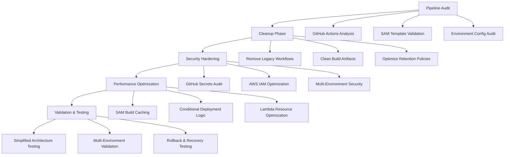

# Design Document - CI/CD Pipeline Optimization

## Overview

This design addresses the optimization of the GitHub Actions CI/CD pipeline for the Automated Video Pipeline project, aligning with the existing simplified architecture and deployment guides. The goal is to ensure the pipeline works perfectly by auditing current configurations, cleaning up unnecessary components, and implementing best practices that complement the Infrastructure as Code approach already established.

## Architecture Alignment

### Current System Context

Based on the Complete Architecture Guide and CI/CD Deployment Guide, the system has:
- **✅ Simplified Architecture**: Self-contained Lambda functions with embedded utilities
- **✅ Infrastructure as Code**: SAM template preventing configuration drift  
- **✅ Multi-Environment Support**: Dev, staging, production environments
- **✅ Complete CI/CD Pipeline**: GitHub Actions with automated testing and deployment
- **✅ Production Ready**: All 7 components operational with real YouTube publishing

### Current Pipeline Analysis

The existing pipeline consists of:
- **Workflow File**: `.github/workflows/deploy-pipeline.yml` (comprehensive 4-job pipeline)
- **Configuration**: `samconfig.toml` with multi-environment support (dev/staging/prod)
- **Template**: `template-simplified.yaml` for infrastructure as code (7 Lambda functions)
- **Scripts**: NPM scripts in `package.json` for local development and CI/CD
- **Validation**: Automated syntax validation and deployment testing

### Optimization Strategy

Aligned with the existing simplified architecture and deployment approach:



### Key Alignment Points

**With Simplified Architecture**:
- Leverage self-contained Lambda functions (no shared layer cleanup needed)
- Optimize for SAM template-based deployments
- Align with existing 7-function architecture

**With Deployment Guide**:
- Follow established SAM CLI deployment patterns
- Maintain consistency with `samconfig.toml` configurations
- Preserve multi-environment deployment strategy

**With CI/CD Implementation**:
- Build upon existing 4-job GitHub Actions workflow
- Enhance existing validation and testing approaches
- Optimize current artifact management and retention

## Components and Interfaces

### 1. Pipeline Audit System

**Purpose**: Analyze current pipeline state and identify optimization opportunities

**Components**:
- Workflow file analyzer
- Artifact usage tracker
- Configuration validator
- Performance metrics collector

**Implementation**:
```javascript
// Pipeline audit script
async function auditPipeline() {
    const workflows = await analyzeWorkflows();
    const artifacts = await reviewArtifacts();
    const configs = await validateConfigurations();
    
    return {
        workflows: workflows.analysis,
        artifacts: artifacts.cleanup_recommendations,
        configs: configs.optimization_suggestions,
        security: await securityAudit()
    };
}
```

### 2. Cleanup and Optimization Engine

**Purpose**: Remove unnecessary components and optimize pipeline configuration

**Components**:
- Artifact cleanup manager
- Workflow optimizer
- Configuration streamliner
- Performance enhancer

**Key Optimizations**:
- Remove unused workflow files
- Clean up old build artifacts
- Optimize caching strategies
- Streamline deployment conditions

### 3. Security Hardening Module

**Purpose**: Ensure pipeline follows security best practices

**Security Measures**:
- GitHub Secrets audit and rotation
- IAM permission optimization
- Environment isolation validation
- Access logging and monitoring

### 4. Performance Monitoring System

**Purpose**: Track and optimize pipeline performance

**Metrics Tracked**:
- Build times and success rates
- Deployment duration and frequency
- Resource usage and costs
- Test execution times

## Data Models

### Pipeline Configuration Schema

Based on the existing `.github/workflows/deploy-pipeline.yml`, optimized structure:

```yaml
# Aligned with existing workflow structure
name: Deploy Automated Video Pipeline
on:
  push:
    branches: [main, develop]
    paths: ['src/lambda/**', 'template-simplified.yaml', '.github/workflows/**']
  pull_request:
    branches: [main]
  workflow_dispatch:
    inputs:
      environment:
        description: 'Environment to deploy to'
        required: true
        default: 'dev'
        type: choice
        options: [dev, staging, prod]

env:
  AWS_REGION: us-east-1
  SAM_TEMPLATE: template-simplified.yaml

jobs:
  # Existing 4-job structure optimized:
  # 1. validate-and-test (enhanced)
  # 2. build-and-package (optimized caching)
  # 3. deploy (multi-environment)
  # 4. notify-and-document (enhanced reporting)
```

### Artifact Management Schema

Aligned with existing S3 bucket structure and SAM deployment patterns:

```javascript
// Artifact retention policy for existing infrastructure
const artifactPolicy = {
    samBuildArtifacts: {
        retention: '30 days',
        location: 'automated-video-pipeline-deployments-{env}',
        maxSize: '500MB',
        cleanupTrigger: 'weekly'
    },
    packagedTemplates: {
        retention: '90 days',
        location: 'S3 deployment buckets per environment',
        maxVersions: 10,
        cleanupTrigger: 'post-deployment'
    },
    githubArtifacts: {
        retention: '30 days', // GitHub Actions default
        maxSize: '100MB',
        cleanupTrigger: 'automatic'
    },
    lambdaDeploymentPackages: {
        retention: '90 days',
        location: 'SAM-managed S3 buckets',
        versioning: 'CloudFormation managed'
    }
};
```

## Error Handling

### 1. Pipeline Failure Recovery

Enhanced error handling aligned with existing SAM deployment approach:

```yaml
# Enhanced error handling in workflow (building on existing structure)
- name: Deploy with enhanced rollback capability
  run: |
    # Use existing samconfig.toml environment configurations
    if ! sam deploy \
      --template-file packaged-template.yaml \
      --stack-name automated-video-pipeline-${{ matrix.environment }} \
      --parameter-overrides Environment=${{ matrix.environment }} \
      --capabilities CAPABILITY_IAM \
      --no-confirm-changeset \
      --no-fail-on-empty-changeset; then
      echo "Deployment failed, initiating rollback..."
      aws cloudformation cancel-update-stack \
        --stack-name automated-video-pipeline-${{ matrix.environment }}
      exit 1
    fi
```

### 2. Security Validation

```javascript
// Security validation checks
async function validateSecurity() {
    const checks = [
        validateSecrets(),
        checkIAMPermissions(),
        auditEnvironmentIsolation(),
        verifyAccessLogs()
    ];
    
    const results = await Promise.all(checks);
    return results.every(check => check.passed);
}
```

### 3. Performance Monitoring

```yaml
# Performance tracking in workflow
- name: Track deployment metrics
  run: |
    START_TIME=$(date +%s)
    # Deployment commands here
    END_TIME=$(date +%s)
    DURATION=$((END_TIME - START_TIME))
    echo "Deployment duration: ${DURATION}s" >> $GITHUB_STEP_SUMMARY
```

## Testing Strategy

### 1. Pipeline Validation Tests

- **Workflow Syntax**: Validate YAML syntax and GitHub Actions schema
- **SAM Template**: Validate CloudFormation template structure
- **Environment Configuration**: Test deployment to all environments
- **Security Compliance**: Verify security best practices

### 2. Performance Tests

- **Build Time**: Measure and optimize build duration
- **Deployment Speed**: Track deployment time across environments
- **Resource Usage**: Monitor AWS resource consumption
- **Cache Efficiency**: Validate caching effectiveness

### 3. Integration Tests

- **End-to-End Pipeline**: Test complete workflow from commit to deployment
- **Rollback Scenarios**: Validate failure recovery mechanisms
- **Multi-Environment**: Test deployment consistency across environments
- **Security Scenarios**: Test access control and secret management

## Implementation Plan

### Phase 1: Audit and Analysis
1. Analyze existing `.github/workflows/deploy-pipeline.yml` and identify optimization opportunities
2. Review GitHub Actions run history and artifact usage patterns
3. Assess current security posture with existing GitHub Secrets and AWS IAM setup
4. Identify performance bottlenecks in the 4-job workflow structure

### Phase 2: Cleanup and Optimization  
1. Remove any legacy workflow files not aligned with simplified architecture
2. Optimize artifact retention policies for SAM deployment buckets
3. Enhance existing workflow caching strategies (Node.js, SAM builds)
4. Streamline deployment conditions to leverage existing path-based triggers

### Phase 3: Security Hardening
1. Audit existing GitHub Secrets (AWS_ACCESS_KEY_ID, AWS_SECRET_ACCESS_KEY, API_KEY)
2. Optimize IAM permissions for the deployment user (currently has broad access)
3. Enhance environment isolation between dev/staging/prod deployments
4. Implement comprehensive CloudWatch logging for deployment activities

### Phase 4: Performance Enhancement
1. Implement advanced caching for SAM builds and Node.js dependencies
2. Optimize the existing build-and-package job for faster execution
3. Set up performance monitoring for the 7 Lambda functions
4. Fine-tune resource allocation based on actual usage patterns

### Phase 5: Validation and Testing
1. Enhance existing deployment validation tests with more comprehensive checks
2. Validate security compliance across all three environments
3. Test rollback scenarios using CloudFormation stack operations
4. Monitor and optimize the complete pipeline performance metrics

## Success Metrics

### Pipeline Reliability
- **Success Rate**: >99% successful deployments
- **Mean Time to Recovery**: <5 minutes for rollbacks
- **Error Rate**: <1% pipeline failures

### Performance Optimization
- **Build Time**: <5 minutes for typical builds
- **Deployment Time**: <10 minutes for full deployment
- **Cache Hit Rate**: >80% for dependency caching

### Security Compliance
- **Secret Rotation**: Monthly rotation schedule
- **Access Audit**: Weekly access review
- **Compliance Score**: 100% security best practices

### Cost Efficiency
- **Resource Usage**: Optimized AWS resource consumption
- **Artifact Storage**: <1GB total artifact storage
- **Build Minutes**: Efficient use of GitHub Actions minutes

This design ensures your CI/CD pipeline operates at peak efficiency with proper cleanup, security, and performance optimization.