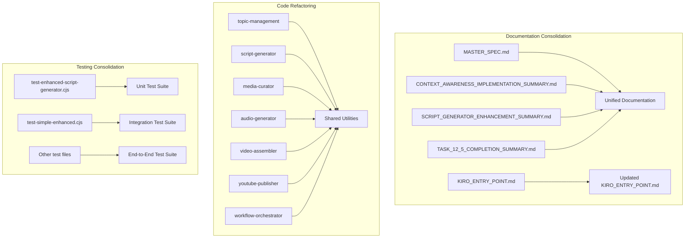

# Design Document

## Overview

This design outlines the comprehensive cleanup and refactoring strategy for the automated video pipeline system. The system currently operates at 100% health with 7 AI agents and enhanced Script Generator capabilities, but requires consolidation of documentation, elimination of code duplication, comprehensive testing, and streamlined deployment processes. The design maintains all existing functionality while improving maintainability and reducing technical debt.

## Architecture

### Current System State Analysis

Based on the MASTER_SPEC, CONTEXT_AWARENESS_IMPLEMENTATION_SUMMARY, and KIRO_ENTRY_POINT, the system has:

- **7 Operational AI Agents**: All at 100% health with enhanced capabilities
- **Enhanced Script Generator**: Professional visual requirements with Bedrock rate limiting
- **Complete Context Flow**: Topic → Script → Media → Audio → Video → YouTube
- **Cost Optimization**: $0.80 per video (20% under target)
- **AWS Infrastructure**: Fully deployed with CDK

### Cleanup Strategy Architecture



## Components and Interfaces

### 1. Documentation Consolidation Component

**Purpose**: Merge scattered documentation into authoritative sources

**Input**: 
- MASTER_SPEC.md (comprehensive system specification)
- CONTEXT_AWARENESS_IMPLEMENTATION_SUMMARY.md (implementation details)
- SCRIPT_GENERATOR_ENHANCEMENT_SUMMARY.md (enhancement details)
- TASK_12_5_COMPLETION_SUMMARY.md (completion status)
- Multiple other .md files

**Output**:
- Consolidated README.md (primary documentation)
- Updated KIRO_ENTRY_POINT.md (current system state)
- Archived historical documents

**Interface**:
```javascript
interface DocumentationConsolidator {
  analyzeDocuments(): DocumentAnalysis;
  mergeContent(documents: Document[]): ConsolidatedDoc;
  updateEntryPoint(currentState: SystemState): void;
  archiveObsolete(documents: Document[]): void;
}
```

### 2. Lambda Refactoring Component

**Purpose**: Extract common functionality into shared utilities

**Current Lambda Functions**:
- `src/lambda/topic-management/` - Topic analysis and context generation
- `src/lambda/script-generator/` - Enhanced script generation with visual requirements
- `src/lambda/media-curator/` - Scene-specific media curation
- `src/lambda/audio-generator/` - AWS Polly audio generation
- `src/lambda/video-assembler/` - FFmpeg video processing
- `src/lambda/youtube-publisher/` - YouTube API integration
- `src/lambda/workflow-orchestrator/` - Pipeline coordination

**Shared Utilities to Extract**:
```javascript
// Context Management Utilities
interface ContextManager {
  validateContext(context: any, schema: ContextSchema): ValidationResult;
  storeContext(context: any, type: ContextType): Promise<string>;
  retrieveContext(contextId: string): Promise<any>;
  compressContext(context: any): CompressedContext;
}

// AWS Service Utilities
interface AWSServiceManager {
  getSecret(secretName: string): Promise<any>;
  uploadToS3(bucket: string, key: string, data: Buffer): Promise<string>;
  queryDynamoDB(tableName: string, query: QueryParams): Promise<any>;
  invokeLambda(functionName: string, payload: any): Promise<any>;
}

// Error Handling Utilities
interface ErrorHandler {
  logError(error: Error, context: any): void;
  createErrorResponse(error: Error): APIResponse;
  shouldRetry(error: Error): boolean;
  getRetryDelay(attempt: number): number;
}
```

### 3. Test Consolidation Component

**Purpose**: Organize and expand test coverage

**Current Test Files**:
- `scripts/tests/test-enhanced-script-generator.cjs`
- `scripts/tests/test-simple-enhanced.cjs`
- `scripts/tests/quick-agent-test.js`
- Various other test scripts

**Consolidated Test Structure**:
```
tests/
├── unit/
│   ├── lambda/
│   │   ├── topic-management.test.js
│   │   ├── script-generator.test.js
│   │   ├── media-curator.test.js
│   │   ├── audio-generator.test.js
│   │   ├── video-assembler.test.js
│   │   ├── youtube-publisher.test.js
│   │   └── workflow-orchestrator.test.js
│   └── shared/
│       ├── context-manager.test.js
│       ├── aws-service-manager.test.js
│       └── error-handler.test.js
├── integration/
│   ├── context-flow.test.js
│   ├── agent-communication.test.js
│   └── end-to-end-pipeline.test.js
└── utils/
    ├── test-helpers.js
    ├── mock-data.js
    └── test-config.js
```

### 4. Deployment Validation Component

**Purpose**: Ensure enhanced capabilities are maintained during cleanup

**Validation Checks**:
```javascript
interface DeploymentValidator {
  validateAgentHealth(): Promise<HealthStatus>;
  validateEnhancedFeatures(): Promise<FeatureStatus>;
  validateContextFlow(): Promise<FlowStatus>;
  validateCostOptimization(): Promise<CostStatus>;
}

interface HealthStatus {
  totalAgents: number;
  healthyAgents: number;
  healthPercentage: number;
  failedAgents: string[];
}

interface FeatureStatus {
  scriptGeneratorEnhanced: boolean;
  rateLimitingActive: boolean;
  professionalVisualRequirements: boolean;
  bedrockFallbackWorking: boolean;
}
```

## Data Models

### System State Model

```javascript
interface SystemState {
  agents: {
    topicManagement: AgentStatus;
    scriptGenerator: AgentStatus;
    mediaCurator: AgentStatus;
    audioGenerator: AgentStatus;
    videoAssembler: AgentStatus;
    youtubePublisher: AgentStatus;
    workflowOrchestrator: AgentStatus;
  };
  enhancedFeatures: {
    scriptGeneratorEnhanced: boolean;
    rateLimitingProtection: boolean;
    professionalVisualRequirements: boolean;
    contextFlowWorking: boolean;
  };
  costMetrics: {
    targetCostPerVideo: number;
    actualCostPerVideo: number;
    costOptimizationPercentage: number;
  };
  lastUpdated: string;
}

interface AgentStatus {
  name: string;
  status: 'operational' | 'degraded' | 'failed';
  lastHealthCheck: string;
  version: string;
  enhancedCapabilities: string[];
}
```

### Cleanup Progress Model

```javascript
interface CleanupProgress {
  documentation: {
    filesAnalyzed: number;
    filesConsolidated: number;
    filesRemoved: number;
    obsoleteFilesArchived: string[];
  };
  codeRefactoring: {
    lambdasAnalyzed: number;
    sharedUtilitiesCreated: number;
    duplicatedCodeRemoved: number;
    codeReductionPercentage: number;
  };
  testing: {
    testFilesConsolidated: number;
    unitTestsCovered: number;
    integrationTestsCreated: number;
    coveragePercentage: number;
  };
  deployment: {
    validationsPassed: number;
    validationsFailed: number;
    systemHealthMaintained: boolean;
  };
}
```

## Error Handling

### Cleanup Error Recovery Strategy

1. **Documentation Consolidation Errors**:
   - **Issue**: Content conflicts during merge
   - **Recovery**: Manual review flags for conflicting sections
   - **Fallback**: Preserve all content with clear section markers

2. **Code Refactoring Errors**:
   - **Issue**: Breaking changes during utility extraction
   - **Recovery**: Automated rollback to previous working state
   - **Validation**: Run health checks after each refactoring step

3. **Test Implementation Errors**:
   - **Issue**: Test failures during consolidation
   - **Recovery**: Isolate failing tests and fix incrementally
   - **Fallback**: Maintain existing working tests while fixing new ones

4. **Deployment Validation Errors**:
   - **Issue**: System degradation during cleanup
   - **Recovery**: Immediate rollback to last known good state
   - **Prevention**: Incremental changes with validation at each step

### Error Handling Patterns

```javascript
class CleanupErrorHandler {
  async executeWithRollback(operation: () => Promise<void>, rollbackFn: () => Promise<void>) {
    const checkpoint = await this.createCheckpoint();
    try {
      await operation();
      await this.validateSystemHealth();
    } catch (error) {
      await rollbackFn();
      await this.restoreCheckpoint(checkpoint);
      throw new CleanupError(`Operation failed: ${error.message}`, error);
    }
  }

  async validateSystemHealth(): Promise<void> {
    const health = await this.deploymentValidator.validateAgentHealth();
    if (health.healthPercentage < 100) {
      throw new SystemDegradationError(`System health degraded to ${health.healthPercentage}%`);
    }
  }
}
```

## Testing Strategy

### Test Coverage Requirements

1. **Unit Tests** (Target: 90% coverage):
   - All Lambda function handlers
   - Shared utility functions
   - Context validation logic
   - Error handling mechanisms

2. **Integration Tests**:
   - Context flow between agents
   - AWS service integrations
   - Enhanced Script Generator features
   - Rate limiting functionality

3. **End-to-End Tests**:
   - Complete pipeline execution
   - Cost optimization validation
   - System health monitoring
   - Deployment validation

### Test Data Management

```javascript
interface TestDataManager {
  generateMockContext(type: ContextType): any;
  createTestProject(): TestProject;
  cleanupTestResources(): Promise<void>;
  validateTestEnvironment(): Promise<boolean>;
}

interface TestProject {
  projectId: string;
  s3Bucket: string;
  dynamodbTables: string[];
  lambdaFunctions: string[];
  cleanup: () => Promise<void>;
}
```

## Performance Considerations

### Cleanup Performance Optimization

1. **Parallel Processing**:
   - Documentation analysis in parallel
   - Lambda refactoring by function
   - Test execution in isolated environments

2. **Incremental Validation**:
   - Health checks after each major change
   - Context flow validation at each step
   - Cost impact monitoring throughout

3. **Resource Management**:
   - Temporary resource cleanup
   - Memory optimization during processing
   - Efficient file I/O operations

### System Performance Maintenance

1. **Lambda Optimization**:
   - Memory allocation review
   - Timeout optimization
   - Cold start reduction

2. **Cost Monitoring**:
   - Maintain $0.80 per video target
   - Monitor resource usage changes
   - Validate cost optimization features

## Security Considerations

### Cleanup Security Measures

1. **Credential Management**:
   - Validate AWS Secrets Manager access
   - Ensure no credentials in consolidated documentation
   - Maintain secure deployment practices

2. **Access Control**:
   - Preserve IAM role configurations
   - Validate least privilege access
   - Maintain security boundaries

3. **Data Protection**:
   - Secure handling of test data
   - Proper cleanup of temporary resources
   - Maintain encryption standards

## Deployment Strategy

### Phased Cleanup Approach

**Phase 1: Documentation Consolidation**
- Analyze and merge documentation files
- Update KIRO_ENTRY_POINT.md with current state
- Archive obsolete completion summaries

**Phase 2: Code Refactoring**
- Extract shared utilities
- Refactor Lambda functions
- Maintain enhanced Script Generator capabilities

**Phase 3: Test Implementation**
- Consolidate test files
- Implement comprehensive test coverage
- Validate system functionality

**Phase 4: Deployment and Validation**
- Deploy consolidated codebase
- Validate system health and enhanced features
- Push to GitHub with proper versioning

### Rollback Strategy

```javascript
interface RollbackManager {
  createSystemSnapshot(): Promise<SystemSnapshot>;
  validateRollbackPoint(snapshot: SystemSnapshot): Promise<boolean>;
  executeRollback(snapshot: SystemSnapshot): Promise<void>;
  verifyRollbackSuccess(): Promise<boolean>;
}
```

This design ensures that the cleanup and refactoring process maintains the current 100% operational status while improving code quality, documentation clarity, and system maintainability.