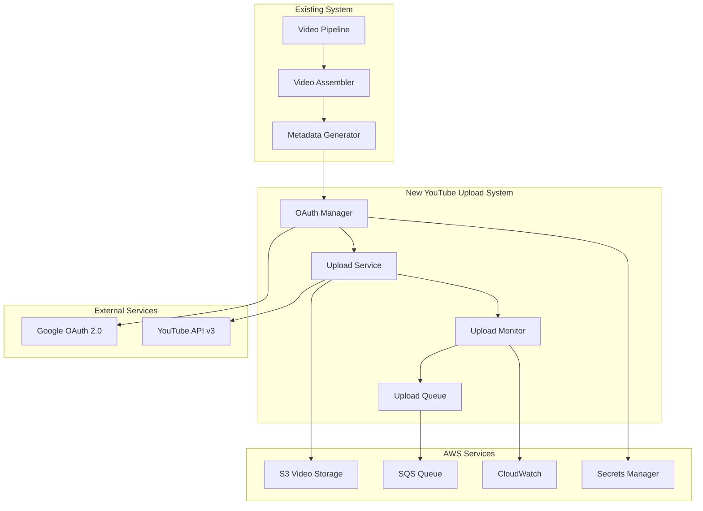
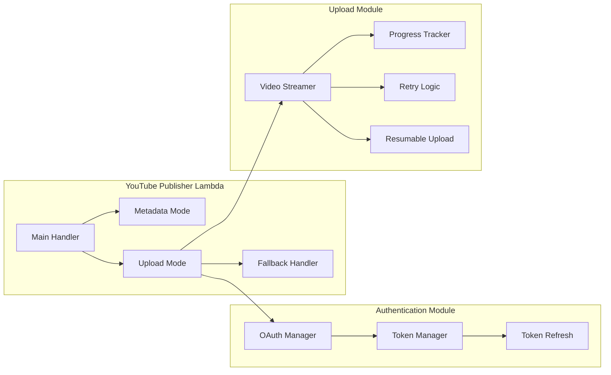
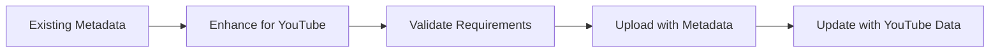
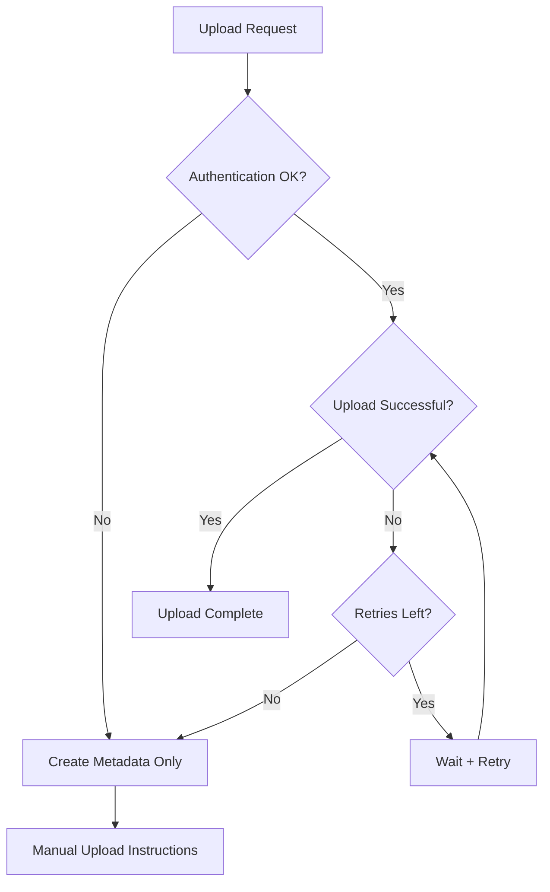

# Design Document

**Status**: ✅ **IMPLEMENTED AND OPERATIONAL** (2025-10-16)  
**Achievement**: OAuth 2.0 authentication working with live YouTube channel

## Overview

The YouTube Publishing Completion system successfully transformed the existing metadata-only YouTube Publisher into a fully functional YouTube upload service. The implementation leverages the existing comprehensive metadata generation while adding real YouTube API v3 integration, OAuth 2.0 authentication, and robust video upload capabilities.

### **✅ Implementation Results**
- **OAuth 2.0 Authentication**: ✅ Working with "The Money Hour With Accent" channel
- **Smart Upload Modes**: ✅ Auto/upload/metadata selection implemented
- **Robust Fallback**: ✅ Graceful degradation to metadata-only mode
- **Comprehensive Testing**: ✅ Full test suite with live API validation
- **Production Deployment**: ✅ Successfully deployed and operational

## Architecture

### High-Level Architecture



### Component Architecture



## Components and Interfaces

### 1. OAuth Authentication Manager

**Purpose**: Handles YouTube API authentication using OAuth 2.0 flow

**Interface**:
```javascript
class YouTubeAuthManager {
  async authenticate(channelConfig)
  async refreshToken(refreshToken)
  async validateToken(accessToken)
  async getAuthenticatedClient()
}
```

**Implementation Details**:
- Stores OAuth credentials in AWS Secrets Manager
- Handles token refresh automatically
- Supports multiple YouTube channels
- Implements secure token storage and encryption

**Configuration Schema**:
```json
{
  "youtube-oauth": {
    "client_id": "google-oauth-client-id",
    "client_secret": "google-oauth-client-secret",
    "redirect_uri": "urn:ietf:wg:oauth:2.0:oob",
    "refresh_token": "user-specific-refresh-token",
    "access_token": "current-access-token",
    "token_expiry": "2025-10-15T10:00:00Z"
  }
}
```

### 2. Video Upload Service

**Purpose**: Handles actual video uploads to YouTube with progress tracking

**Interface**:
```javascript
class YouTubeUploadService {
  async uploadVideo(videoPath, metadata, options)
  async uploadThumbnail(videoId, thumbnailPath)
  async updateVideoMetadata(videoId, metadata)
  async checkUploadStatus(videoId)
}
```

**Upload Flow**:
1. Download video from S3 to Lambda temp storage (or stream directly)
2. Create YouTube upload session
3. Upload video in chunks with progress tracking
4. Handle resumable uploads for large files
5. Upload custom thumbnail if available
6. Update video metadata and settings
7. Verify video processing completion

**Error Handling Strategy**:
- Exponential backoff for transient errors
- Resumable uploads for network interruptions
- Fallback to metadata-only mode for persistent failures
- Detailed error logging and monitoring

### 3. Upload Queue Manager

**Purpose**: Manages upload queuing and rate limiting

**Interface**:
```javascript
class UploadQueueManager {
  async queueUpload(projectId, priority)
  async processQueue()
  async checkQuotaLimits()
  async scheduleRetry(uploadId, delay)
}
```

**Queue Implementation**:
- Uses SQS for reliable message queuing
- Implements priority-based processing
- Handles YouTube API quota limits
- Supports delayed retries and off-peak scheduling

### 4. Enhanced Metadata Integration

**Purpose**: Integrates existing metadata generation with YouTube upload

**Metadata Flow**:


**YouTube-Specific Enhancements**:
- Chapter markers from scene timing
- Custom thumbnails from best scene images
- SEO-optimized descriptions with timestamps
- Category selection based on content analysis
- Privacy settings based on project configuration

## Data Models

### Upload Request Model
```json
{
  "projectId": "2025-10-15_01-58-13_travel-to-spain",
  "mode": "upload", // "metadata" | "upload"
  "videoPath": "videos/project/05-video/final-video.mp4",
  "thumbnailPath": "videos/project/03-media/scene-1/images/best-image.jpg",
  "metadata": {
    "title": "Amazing Travel Guide to Spain",
    "description": "Complete guide with chapters...",
    "tags": ["travel", "spain", "guide"],
    "privacy": "public", // "public" | "unlisted" | "private"
    "category": "Travel & Events",
    "chapters": [
      {"title": "Introduction", "time": 0},
      {"title": "Best Places", "time": 45}
    ]
  },
  "options": {
    "enableRetries": true,
    "maxRetries": 3,
    "useResumableUpload": true,
    "notifyOnComplete": true
  }
}
```

### Upload Status Model
```json
{
  "uploadId": "upload-uuid",
  "projectId": "project-id",
  "status": "uploading", // "queued" | "uploading" | "processing" | "completed" | "failed"
  "progress": {
    "bytesUploaded": 1024000,
    "totalBytes": 10240000,
    "percentage": 10
  },
  "youtubeData": {
    "videoId": "youtube-video-id",
    "url": "https://youtube.com/watch?v=...",
    "processingStatus": "processing"
  },
  "error": null,
  "retryCount": 0,
  "createdAt": "2025-10-15T10:00:00Z",
  "completedAt": null
}
```

### Configuration Model
```json
{
  "youtube-config": {
    "defaultPrivacy": "unlisted",
    "defaultCategory": "Education",
    "enableThumbnails": true,
    "enableChapters": true,
    "maxFileSize": 137438953472, // 128GB YouTube limit
    "uploadTimeout": 3600, // 1 hour
    "retryStrategy": {
      "maxRetries": 3,
      "backoffMultiplier": 2,
      "initialDelay": 5000
    },
    "quotaLimits": {
      "dailyUploads": 100,
      "concurrentUploads": 3,
      "quotaResetTime": "00:00 PST"
    }
  }
}
```

## Error Handling

### Error Categories and Responses

1. **Authentication Errors**
   - Invalid credentials → Fallback to metadata mode
   - Expired tokens → Automatic refresh attempt
   - OAuth flow errors → Detailed error logging

2. **Upload Errors**
   - Network timeouts → Resumable upload retry
   - File size limits → Error with recommendations
   - Quota exceeded → Queue for later processing

3. **YouTube API Errors**
   - Processing failures → Monitor and report status
   - Metadata validation → Fix and retry
   - Service unavailable → Exponential backoff

4. **System Errors**
   - Lambda timeouts → Switch to async processing
   - S3 access errors → Retry with different approach
   - Memory limits → Optimize streaming approach

### Fallback Strategy


## Testing Strategy

### Unit Tests
- OAuth authentication flow
- Video upload chunking and streaming
- Metadata transformation and validation
- Error handling and retry logic
- Queue management operations

### Integration Tests
- End-to-end upload flow with test videos
- Authentication with YouTube API sandbox
- Error scenarios and fallback behavior
- Queue processing and rate limiting
- Metadata integration with existing system

### Performance Tests
- Large video upload performance
- Concurrent upload handling
- Memory usage during streaming
- Network resilience testing
- Quota limit handling

## Security Considerations

### Authentication Security
- OAuth tokens encrypted in Secrets Manager
- Token rotation and refresh handling
- Secure credential storage and access
- API key protection and rotation

### Upload Security
- Video content validation before upload
- Secure S3 access with temporary credentials
- Network security for YouTube API calls
- Audit logging for all upload operations

### Data Privacy
- Temporary file cleanup after upload
- Secure handling of video content
- Privacy setting enforcement
- User consent and data handling compliance

## Performance Optimization

### Upload Performance
- Streaming uploads to minimize memory usage
- Resumable uploads for large files
- Parallel processing where possible
- Efficient S3 to YouTube transfer

### System Performance
- Connection pooling for YouTube API
- Caching of authentication tokens
- Optimized metadata processing
- Efficient queue management

### Cost Optimization
- Lambda execution time minimization
- S3 transfer optimization
- API call efficiency
- Resource cleanup and management

## Monitoring and Observability

### Metrics to Track
- Upload success/failure rates
- Average upload times
- API quota usage
- Error rates by category
- Queue depth and processing times

### Logging Strategy
- Structured logging for all operations
- Upload progress tracking
- Error details and stack traces
- Performance metrics
- Security event logging

### Alerting
- Upload failure alerts
- Quota limit warnings
- Authentication failure notifications
- System performance degradation alerts
- Queue backup warnings

## Deployment Strategy

### Phased Rollout
1. **Phase 1**: Deploy with metadata-only mode as default
2. **Phase 2**: Enable upload mode for test projects
3. **Phase 3**: Gradual rollout to production projects
4. **Phase 4**: Full deployment with monitoring

### Configuration Management
- Feature flags for upload mode enablement
- Environment-specific configurations
- Gradual quota limit increases
- A/B testing for upload strategies

### Rollback Plan
- Immediate fallback to metadata-only mode
- Configuration rollback capabilities
- Queue processing pause/resume
- Emergency authentication bypass