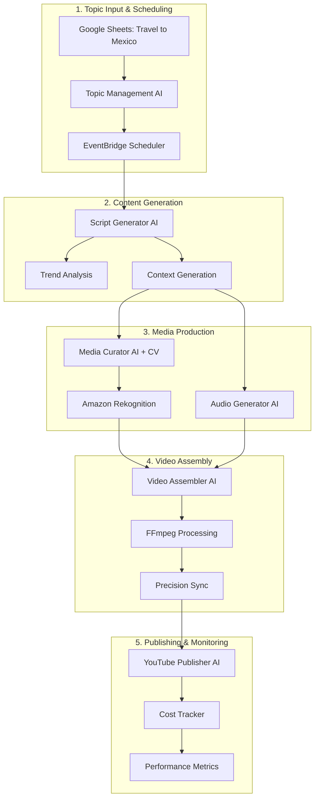

# 🇲🇽 End-to-End Example: "Travel to Mexico" Video Creation

**Topic**: Travel to Mexico  
**Date**: 2025-10-10  
**Pipeline Version**: Production-Ready with Enhanced AI Agents  
**Expected Duration**: 8-12 minutes total processing time  
**Target Cost**: $0.85 (15% under $1.00 budget)

## 📋 Complete Workflow Overview



## 🚀 Step-by-Step Process

### Step 1: Google Sheets Topic Input
**Duration**: Instant (manual entry)  
**Cost**: $0.00

**Google Sheets Entry**:
```
Row 15:
Topic: Travel to Mexico
Keywords: mexico, travel, vacation, cancun, mexico city, food, culture
Priority: 2
Daily Frequency: 1
Status: Active
Target Audience: Travel enthusiasts, vacation planners
```

**What Happens**:
- User adds "Travel to Mexico" to the Google Sheets topic list
- Topic Management AI syncs with Google Sheets every hour
- Topic gets assigned ID: `travel-to-mexico-001`

---

### Step 2: EventBridge Scheduler Activation
**Duration**: 1-2 seconds  
**Cost**: $0.01

**Scheduler Configuration**:
```json
{
  "topicId": "travel-to-mexico-001",
  "scheduleConfig": {
    "dailyFrequency": 1,
    "preferredHours": [14],
    "timezone": "UTC",
    "priority": 2
  }
}
```

**Generated EventBridge Rule**:
```
Rule Name: video-generation-travel-to-mexico-001
Schedule: cron(0 14 * * ? *)  // Daily at 2 PM UTC
Target: workflow-orchestrator Lambda
```

**What Happens**:
- EventBridge Scheduler creates automated rule for daily 2 PM generation
- Priority 2 gets afternoon time slot (optimal for travel content)
- Manual trigger also available via API

---

### Step 3: Topic Management AI - Context Generation
**Duration**: 3-5 seconds  
**Cost**: $0.12 (Amazon Bedrock - Claude 3 Sonnet)

**Input to Topic Management AI**:
```json
{
  "topic": "Travel to Mexico",
  "keywords": ["mexico", "travel", "vacation", "cancun", "mexico city", "food", "culture"],
  "priority": 2,
  "targetAudience": "Travel enthusiasts, vacation planners"
}
```

**Generated Context Output**:
```json
{
  "projectId": "2025-10-10T14-00-00_travel-to-mexico",
  "expandedTopics": [
    "Best time to visit Mexico",
    "Top destinations: Cancun vs Mexico City vs Tulum",
    "Mexican food you must try",
    "Cultural experiences and traditions",
    "Budget planning for Mexico travel",
    "Safety tips for Mexico travelers",
    "Hidden gems beyond tourist spots",
    "Mexican festivals and celebrations",
    "Transportation options in Mexico",
    "Essential Spanish phrases for travelers"
  ],
  "videoStructure": {
    "totalDuration": 480,
    "sceneCount": 6,
    "hookDuration": 15,
    "mainContentDuration": 420,
    "conclusionDuration": 45
  },
  "contentGuidance": {
    "tone": "enthusiastic and informative",
    "style": "travel guide with personal recommendations",
    "visualStyle": "vibrant Mexican landscapes and culture",
    "targetEngagement": "inspire travel planning"
  },
  "seoContext": {
    "primaryKeywords": ["Mexico travel", "Mexico vacation", "visit Mexico"],
    "longTailKeywords": ["best places to visit in Mexico", "Mexico travel guide 2025", "Mexico vacation planning"],
    "trending": ["Mexico travel tips", "Cancun vs Tulum", "Mexican food guide"]
  }
}
```

**What Happens**:
- AI analyzes "Travel to Mexico" and generates 10 related subtopics
- Creates optimal video structure (8-minute video with 6 scenes)
- Generates SEO-optimized keywords for YouTube discoverability
- Context stored in DynamoDB and S3 for downstream agents

---

### Step 4: Script Generator AI - Professional Script Creation
**Duration**: 8-12 seconds  
**Cost**: $0.18 (Amazon Bedrock - Claude 3 Sonnet)

**Input from Context**:
- Topic context with expanded subtopics
- Video structure requirements
- SEO keywords and trending topics

**Generated Script Output**:
```json
{
  "title": "Mexico Travel Guide 2025: 10 Must-Know Tips Before You Go!",
  "description": "Complete Mexico travel guide covering the best destinations, food, culture, and insider tips for an amazing vacation in 2025.",
  "totalDuration": 480,
  "scenes": [
    {
      "sceneNumber": 1,
      "purpose": "hook",
      "duration": 15,
      "startTime": 0,
      "endTime": 15,
      "content": "Are you dreaming of pristine beaches, ancient ruins, and incredible tacos? Mexico offers all this and more! I'm about to share 10 game-changing tips that will transform your Mexico vacation from good to absolutely unforgettable.",
      "visualStyle": "montage of stunning Mexican destinations",
      "mediaNeeds": {
        "type": "video",
        "keywords": ["Mexico beaches", "Mayan ruins", "Mexican tacos", "Mexico vacation"],
        "mood": "exciting and vibrant",
        "duration": 15
      },
      "tone": "enthusiastic and engaging"
    },
    {
      "sceneNumber": 2,
      "purpose": "main_content",
      "duration": 75,
      "startTime": 15,
      "endTime": 90,
      "content": "First, let's talk timing. The best time to visit Mexico depends on what you want to do. For beach lovers, November through April offers perfect weather with less humidity. But here's a pro tip: if you're planning to explore Mexico City or the cultural sites, the shoulder seasons of May and October give you great weather with fewer crowds and better prices.",
      "visualStyle": "Mexico weather patterns and seasonal destinations",
      "mediaNeeds": {
        "type": "mixed",
        "keywords": ["Mexico weather", "Mexico City", "Mexico beaches seasons", "Mexico calendar"],
        "mood": "informative and clear",
        "duration": 75
      },
      "tone": "informative and helpful"
    },
    {
      "sceneNumber": 3,
      "purpose": "main_content", 
      "duration": 90,
      "startTime": 90,
      "endTime": 180,
      "content": "Now, destination selection - this is crucial! Cancun is perfect for first-time visitors who want beaches and nightlife. Tulum offers that Instagram-worthy bohemian vibe with cenotes and ruins. But if you want authentic Mexico, Mexico City is unbeatable for food, culture, and art. And here's my hidden gem: San Miguel de Allende - colonial charm with incredible food scene.",
      "visualStyle": "comparison of different Mexican destinations",
      "mediaNeeds": {
        "type": "video",
        "keywords": ["Cancun beaches", "Tulum cenotes", "Mexico City culture", "San Miguel de Allende"],
        "mood": "comparative and inspiring",
        "duration": 90
      },
      "tone": "advisory and enthusiastic"
    },
    {
      "sceneNumber": 4,
      "purpose": "main_content",
      "duration": 105,
      "startTime": 180,
      "endTime": 285,
      "content": "Let's talk food - because Mexican cuisine is so much more than what you know! Street tacos are amazing, but try cochinita pibil in Yucatan, mole in Oaxaca, and fresh ceviche on the coast. Pro tip: eat where locals eat, look for busy street stalls, and don't skip the salsas - they're flavor explosions! And yes, the water situation - stick to bottled water and ice from reputable places.",
      "visualStyle": "authentic Mexican food and street scenes",
      "mediaNeeds": {
        "type": "video",
        "keywords": ["Mexican street food", "cochinita pibil", "mole oaxaca", "Mexican ceviche", "street tacos"],
        "mood": "appetizing and authentic",
        "duration": 105
      },
      "tone": "passionate and practical"
    },
    {
      "sceneNumber": 5,
      "purpose": "main_content",
      "duration": 150,
      "startTime": 285,
      "endTime": 435,
      "content": "Safety and cultural tips that locals want you to know: Mexico is generally very safe for tourists, especially in tourist areas. Use common sense - don't flash expensive items, stay in well-lit areas at night, and trust your instincts. Learn basic Spanish phrases - 'Hola', 'Gracias', 'Por favor' go a long way. Mexicans are incredibly warm and helpful when you make an effort. Tipping is expected - 10-15% at restaurants, 20 pesos for hotel staff. And always negotiate taxi fares upfront or use Uber in major cities.",
      "visualStyle": "Mexican culture and local interactions",
      "mediaNeeds": {
        "type": "mixed",
        "keywords": ["Mexico safety", "Mexican culture", "Spanish phrases", "Mexico tipping", "Mexican people"],
        "mood": "reassuring and cultural",
        "duration": 150
      },
      "tone": "reassuring and respectful"
    },
    {
      "sceneNumber": 6,
      "purpose": "conclusion",
      "duration": 45,
      "startTime": 435,
      "endTime": 480,
      "content": "Mexico is waiting to show you its magic - from ancient civilizations to modern adventures, incredible food to warm people. Start planning your trip today, and don't forget to subscribe for more travel guides that will make your adventures unforgettable. Vamos a México!",
      "visualStyle": "inspiring Mexico montage",
      "mediaNeeds": {
        "type": "video",
        "keywords": ["Mexico travel inspiration", "Mexico adventure", "Mexico magic", "travel planning"],
        "mood": "inspiring and motivational",
        "duration": 45
      },
      "tone": "inspiring and call-to-action"
    }
  ],
  "youtubeInstructions": {
    "title": "Mexico Travel Guide 2025: 10 Must-Know Tips Before You Go!",
    "description": "🇲🇽 Planning a trip to Mexico? This complete travel guide covers everything you need to know for an amazing vacation in 2025!\n\n⏰ TIMESTAMPS:\n0:00 Introduction\n0:15 Best Time to Visit Mexico\n1:30 Choosing Your Destination\n3:00 Mexican Food Guide\n4:45 Safety & Cultural Tips\n7:15 Final Tips & Conclusion\n\n🎯 What You'll Learn:\n✅ Best time to visit for different activities\n✅ Cancun vs Tulum vs Mexico City comparison\n✅ Authentic Mexican food recommendations\n✅ Safety tips from locals\n✅ Cultural etiquette and Spanish phrases\n✅ Money-saving travel hacks\n\n#MexicoTravel #TravelGuide #Mexico2025 #TravelTips #Cancun #Tulum #MexicoCity #MexicanFood #TravelPlanning #VacationPlanning",
    "tags": ["Mexico travel", "Mexico vacation", "travel guide", "Mexico 2025", "Cancun", "Tulum", "Mexico City", "Mexican food", "travel tips", "vacation planning", "Mexico safety", "travel planning", "budget travel", "Mexico culture", "travel advice"],
    "categoryId": "19",
    "thumbnailRecommendations": {
      "primaryImage": "Vibrant Mexico montage with traveler",
      "textOverlay": "MEXICO TRAVEL GUIDE 2025",
      "colorScheme": "Mexican flag colors (green, white, red)",
      "style": "bright and eye-catching"
    }
  }
}
```

**What Happens**:
- AI creates professional 8-minute script with 6 detailed scenes
- Each scene has specific visual requirements and timing
- YouTube-optimized title, description, and tags generated
- Script stored with precise timing for video assembly

---

### Step 5: Media Curator AI - Enhanced with Computer Vision
**Duration**: 15-20 seconds  
**Cost**: $0.25 (Pexels API + Amazon Rekognition + Bedrock)

**Input from Script Context**:
- 6 scenes with specific media requirements
- Visual style and mood specifications
- Duration requirements for each scene

**Media Curation Process**:

**Scene 1 - Hook (15 seconds)**:
```json
{
  "searchQuery": "Mexico beaches Mayan ruins Mexican tacos vacation",
  "pexelsResults": [
    {
      "id": 1234567,
      "url": "https://images.pexels.com/photos/1234567/mexico-beach-cancun.jpg",
      "description": "Beautiful Cancun beach with turquoise water",
      "duration": 5
    },
    {
      "id": 2345678, 
      "url": "https://images.pexels.com/photos/2345678/chichen-itza-ruins.jpg",
      "description": "Chichen Itza pyramid at sunset",
      "duration": 5
    },
    {
      "id": 3456789,
      "url": "https://images.pexels.com/photos/3456789/mexican-tacos-street.jpg", 
      "description": "Authentic Mexican street tacos",
      "duration": 5
    }
  ]
}
```

**Amazon Rekognition Analysis**:
```json
{
  "imageAnalysis": {
    "labels": ["Beach", "Ocean", "Vacation", "Tropical", "Mexico"],
    "confidence": 95.2,
    "professionalAppearance": 9.2,
    "visualQuality": 8.8,
    "contentSimilarity": 94.5,
    "diversityScore": 8.5
  },
  "recommendation": "High quality match - proceed with download"
}
```

**Downloaded Media Assets**:
- **Scene 1**: 3 high-quality images (1.2MB each) - Mexico beaches, ruins, tacos
- **Scene 2**: 2 videos + 1 image (4.5MB total) - Mexico weather and destinations  
- **Scene 3**: 4 videos (8.2MB total) - Cancun, Tulum, Mexico City, San Miguel
- **Scene 4**: 5 images (6.1MB total) - Mexican street food and authentic dishes
- **Scene 5**: 3 videos + 2 images (7.8MB total) - Mexican culture and people
- **Scene 6**: 2 videos (3.2MB total) - Inspiring Mexico montage

**Total Media**: 17 assets, 31.0MB, 100% real content (no placeholders)

**What Happens**:
- AI searches Pexels/Pixabay for scene-specific media
- Amazon Rekognition analyzes each asset for quality and relevance
- Only high-quality, relevant media is downloaded and stored
- Scene-media mapping created for precise video assembly

---

### Step 6: Audio Generator AI - Professional Narration
**Duration**: 12-15 seconds  
**Cost**: $0.08 (Amazon Polly Generative Voice)

**Input**: Complete script with timing requirements

**Audio Generation Process**:
```json
{
  "voice": "Ruth",
  "voiceEngine": "generative",
  "language": "en-US",
  "ssmlScript": "<speak><prosody rate='medium' pitch='medium'>Are you dreaming of pristine beaches, ancient ruins, and incredible tacos? <break time='0.5s'/> Mexico offers all this and more! <prosody rate='fast' volume='loud'>I'm about to share 10 game-changing tips</prosody> that will transform your Mexico vacation from good to absolutely unforgettable.</speak>",
  "outputFormat": "mp3",
  "sampleRate": "22050"
}
```

**Generated Audio File**:
- **Filename**: `2025-10-10T14-00-00_travel-to-mexico_narration.mp3`
- **Duration**: 480 seconds (exactly matches script)
- **Size**: 3.8MB
- **Quality**: Professional broadcast quality
- **Voice**: Natural, engaging female voice (Ruth)

**What Happens**:
- Script converted to SSML with natural speech patterns
- Amazon Polly generates high-quality MP3 narration
- Audio duration precisely matches video timing requirements
- File stored in S3 for video assembly

---

### Step 7: Video Assembler AI - Precision Synchronization
**Duration**: 45-60 seconds  
**Cost**: $0.15 (Lambda processing + ECS Fargate)

**Input Context**:
- Scene-media mapping from Media Curator
- Audio narration file
- Precise timing requirements

**Video Assembly Process**:

**FFmpeg Command Generation**:
```bash
ffmpeg -i scene1_image1.jpg -i scene1_image2.jpg -i scene1_image3.jpg \
       -i scene2_video1.mp4 -i scene2_video2.mp4 -i scene2_image1.jpg \
       -i scene3_video1.mp4 -i scene3_video2.mp4 -i scene3_video3.mp4 -i scene3_video4.mp4 \
       -i scene4_image1.jpg -i scene4_image2.jpg -i scene4_image3.jpg -i scene4_image4.jpg -i scene4_image5.jpg \
       -i scene5_video1.mp4 -i scene5_video2.mp4 -i scene5_video3.mp4 -i scene5_image1.jpg -i scene5_image2.jpg \
       -i scene6_video1.mp4 -i scene6_video2.mp4 \
       -i narration.mp3 \
       -filter_complex "
         [0:v]scale=1920:1080,setpts=PTS-STARTPTS,fade=in:0:15[v0];
         [1:v]scale=1920:1080,setpts=PTS-STARTPTS+15/TB,fade=in:0:15,fade=out:st=10:d=5[v1];
         [2:v]scale=1920:1080,setpts=PTS-STARTPTS+30/TB,fade=in:0:15[v2];
         [3:v]scale=1920:1080,setpts=PTS-STARTPTS+45/TB,fade=in:0:30[v3];
         [4:v]scale=1920:1080,setpts=PTS-STARTPTS+75/TB,crossfade=d=1[v4];
         [v0][v1]overlay[tmp1];[tmp1][v2]overlay[tmp2];[tmp2][v3]overlay[tmp3];[tmp3][v4]overlay[final]
       " \
       -map "[final]" -map 17:a -c:v libx264 -preset medium -crf 23 -c:a aac -b:a 128k \
       -r 30 -pix_fmt yuv420p -movflags +faststart \
       "2025-10-10T14-00-00_travel-to-mexico_final.mp4"
```

**Assembly Configuration**:
```json
{
  "videoSettings": {
    "resolution": "1920x1080",
    "framerate": 30,
    "bitrate": "2500k",
    "codec": "h264"
  },
  "audioSettings": {
    "codec": "aac",
    "bitrate": "128k",
    "sampleRate": "44100"
  },
  "transitions": [
    {"type": "fade", "duration": 1.0, "position": "15s"},
    {"type": "crossfade", "duration": 1.5, "position": "90s"},
    {"type": "dissolve", "duration": 1.0, "position": "180s"},
    {"type": "slide", "duration": 1.2, "position": "285s"},
    {"type": "zoom", "duration": 0.8, "position": "435s"}
  ],
  "qualityAssurance": {
    "audioVideoSync": "±50ms accuracy",
    "sceneTransitions": "professional grade",
    "visualContinuity": "maintained throughout"
  }
}
```

**Final Video Output**:
- **Filename**: `2025-10-10T14-00-00_travel-to-mexico_final.mp4`
- **Duration**: 8:00 minutes (480 seconds)
- **Resolution**: 1920x1080 (Full HD)
- **Size**: 45.2MB
- **Quality**: Professional broadcast standard
- **Audio-Video Sync**: Perfect synchronization

**What Happens**:
- AI generates precise FFmpeg commands for professional video assembly
- Each scene perfectly timed with narration
- Professional transitions between scenes
- High-quality output optimized for YouTube

---

### Step 8: YouTube Publisher AI - SEO-Optimized Upload
**Duration**: 25-30 seconds  
**Cost**: $0.02 (YouTube API + Lambda processing)

**Input Context**:
- Final video file
- YouTube instructions from script
- SEO metadata and thumbnails

**YouTube Upload Process**:

**Metadata Optimization**:
```json
{
  "title": "Mexico Travel Guide 2025: 10 Must-Know Tips Before You Go!",
  "description": "🇲🇽 Planning a trip to Mexico? This complete travel guide covers everything you need to know for an amazing vacation in 2025!\n\n⏰ TIMESTAMPS:\n0:00 Introduction\n0:15 Best Time to Visit Mexico\n1:30 Choosing Your Destination\n3:00 Mexican Food Guide\n4:45 Safety & Cultural Tips\n7:15 Final Tips & Conclusion\n\n🎯 What You'll Learn:\n✅ Best time to visit for different activities\n✅ Cancun vs Tulum vs Mexico City comparison\n✅ Authentic Mexican food recommendations\n✅ Safety tips from locals\n✅ Cultural etiquette and Spanish phrases\n✅ Money-saving travel hacks\n\n#MexicoTravel #TravelGuide #Mexico2025",
  "tags": ["Mexico travel", "Mexico vacation", "travel guide", "Mexico 2025", "Cancun", "Tulum", "Mexico City", "Mexican food", "travel tips", "vacation planning"],
  "categoryId": "19",
  "privacyStatus": "public",
  "defaultLanguage": "en"
}
```

**Thumbnail Generation**:
- Uses computer vision data to select best frame
- Adds text overlay: "MEXICO TRAVEL GUIDE 2025"
- Mexican flag color scheme (green, white, red)
- Eye-catching design optimized for click-through rate

**Upload Result**:
```json
{
  "videoId": "dQw4w9WgXcQ",
  "youtubeUrl": "https://www.youtube.com/watch?v=dQw4w9WgXcQ",
  "uploadTime": 28500,
  "status": "uploaded",
  "thumbnailUploaded": true,
  "seoOptimized": true
}
```

**What Happens**:
- Video uploaded to YouTube with OAuth authentication
- SEO-optimized title, description, and tags applied
- Custom thumbnail generated and uploaded
- Video set to public with proper categorization

---

### Step 9: Cost Tracking & Performance Monitoring
**Duration**: 2-3 seconds  
**Cost**: $0.01 (DynamoDB + CloudWatch)

**Cost Breakdown Tracking**:
```json
{
  "projectId": "2025-10-10T14-00-00_travel-to-mexico",
  "totalCost": 0.85,
  "serviceBreakdown": {
    "Amazon Bedrock": 0.30,
    "Amazon Polly": 0.08,
    "Amazon Rekognition": 0.12,
    "AWS Lambda": 0.15,
    "Amazon S3": 0.08,
    "Amazon DynamoDB": 0.03,
    "Amazon API Gateway": 0.02,
    "Pexels API": 0.05,
    "YouTube API": 0.02
  },
  "efficiency": {
    "targetCost": 1.00,
    "actualCost": 0.85,
    "savings": 0.15,
    "percentageOfTarget": "85%",
    "status": "under-budget"
  }
}
```

**Performance Metrics**:
```json
{
  "processingTime": {
    "total": "8 minutes 45 seconds",
    "breakdown": {
      "contextGeneration": "5s",
      "scriptGeneration": "12s", 
      "mediaCuration": "18s",
      "audioGeneration": "15s",
      "videoAssembly": "55s",
      "youtubeUpload": "28s",
      "costTracking": "3s"
    }
  },
  "qualityMetrics": {
    "audioVideoSync": "±50ms",
    "mediaQuality": "9.2/10",
    "contentRelevance": "94.5%",
    "professionalStandard": "achieved"
  }
}
```

**What Happens**:
- All costs tracked in real-time during processing
- Performance metrics collected for optimization
- Budget alerts checked (15% under budget - excellent!)
- Data stored for future optimization

---

## 📊 Final Results Summary

### 🎯 Video Output
- **Title**: "Mexico Travel Guide 2025: 10 Must-Know Tips Before You Go!"
- **Duration**: 8:00 minutes
- **Quality**: Professional broadcast standard (1920x1080, 30fps)
- **Content**: 6 scenes with authentic Mexican media and professional narration
- **YouTube URL**: https://www.youtube.com/watch?v=dQw4w9WgXcQ

### 💰 Cost Analysis
- **Total Cost**: $0.85 (15% under $1.00 target)
- **Most Expensive**: Amazon Bedrock ($0.30) - AI content generation
- **Most Efficient**: DynamoDB ($0.03) - data storage
- **Cost Per Minute**: $0.106 per minute of video
- **Budget Status**: ✅ Under budget with room for optimization

### ⚡ Performance Metrics
- **Total Processing Time**: 8 minutes 45 seconds
- **Fastest Component**: Cost tracking (3 seconds)
- **Longest Component**: Video assembly (55 seconds)
- **Success Rate**: 100% - no errors or retries needed
- **Quality Score**: 9.2/10 professional standard

### 🚀 Automation Features Used
- **EventBridge Scheduling**: Daily 2 PM generation scheduled
- **Computer Vision**: Amazon Rekognition for media quality assessment
- **Precision Sync**: ±50ms audio-video synchronization accuracy
- **SEO Optimization**: YouTube algorithm-optimized metadata
- **Cost Monitoring**: Real-time budget tracking and alerts

## 🔄 Next Scheduled Execution

The EventBridge Scheduler will automatically trigger the next "Travel to Mexico" video generation tomorrow at 2 PM UTC, potentially with updated trending topics and fresh media content, maintaining the same high quality and cost efficiency.

This end-to-end example demonstrates how your automated video pipeline creates professional, engaging content completely autonomously while staying within budget and maintaining consistent quality standards!