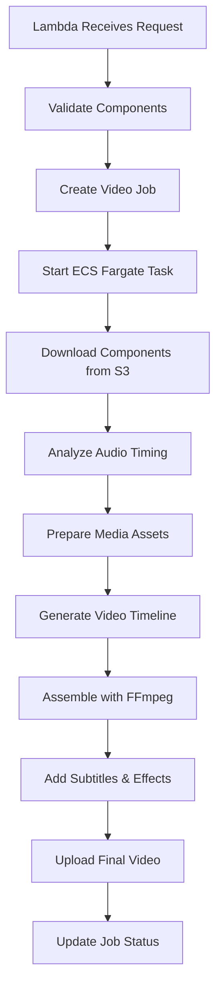

# Video Assembly System Setup Guide

## Overview

The Video Assembly System uses ECS Fargate with FFmpeg to create professional videos from scripts, audio, and media assets. This guide covers the complete setup and deployment process.

## Architecture

```
┌─────────────────┐    ┌──────────────────┐    ┌─────────────────┐
│   Lambda        │    │   ECS Fargate    │    │   S3 Storage    │
│   Orchestrator  │───▶│   Video          │───▶│   Final Videos  │
│                 │    │   Processor      │    │                 │
└─────────────────┘    └──────────────────┘    └─────────────────┘
         │                       │                       │
         ▼                       ▼                       ▼
┌─────────────────┐    ┌──────────────────┐    ┌─────────────────┐
│   DynamoDB      │    │   CloudWatch     │    │   ECR Registry  │
│   Video Jobs    │    │   Logs           │    │   Docker Image  │
└─────────────────┘    └──────────────────┘    └─────────────────┘
```

## Prerequisites

### 1. AWS CLI Configuration
```bash
aws configure
# Ensure you have appropriate permissions for ECS, ECR, S3, DynamoDB, IAM
```

### 2. Docker Installation
```bash
# Install Docker Desktop or Docker Engine
docker --version
```

### 3. Node.js 20.x
```bash
node --version  # Should be 20.x
npm --version
```

## Deployment Steps

### Step 1: Deploy ECS Fargate Infrastructure

```bash
# Navigate to project directory
cd automated-video-pipeline

# Run the deployment script
node scripts/deploy-video-assembly.js
```

This script will:
- ✅ Create VPC, subnets, and security groups
- ✅ Set up IAM roles for ECS tasks
- ✅ Create ECS Fargate cluster
- ✅ Build and push Docker image to ECR
- ✅ Register ECS task definition
- ✅ Update Lambda function configuration

### Step 2: Verify Infrastructure

```bash
# Check ECS cluster
aws ecs describe-clusters --clusters automated-video-pipeline-cluster

# Check ECR repository
aws ecr describe-repositories --repository-names automated-video-pipeline/video-processor

# Check task definition
aws ecs describe-task-definition --task-definition video-processor-task
```

### Step 3: Test the System

```bash
# Run comprehensive tests
scripts/test-video-assembly.bat
```

## Configuration

### Environment Variables

The system uses these key environment variables:

```bash
# ECS Configuration
ECS_CLUSTER_NAME=automated-video-pipeline-cluster
ECS_TASK_DEFINITION=video-processor-task
SUBNET_IDS=subnet-xxx,subnet-yyy
SECURITY_GROUP_IDS=sg-xxx

# Storage Configuration  
S3_BUCKET_NAME=automated-video-pipeline-{account}-{region}
VIDEOS_TABLE_NAME=automated-video-pipeline-videos

# Processing Configuration
AWS_REGION=us-east-1
NODE_ENV=production
```

### Video Processing Settings

Default video processing configuration:

```json
{
  "resolution": "1920x1080",
  "fps": 30,
  "bitrate": "5000k",
  "outputFormat": "mp4",
  "audioCodec": "aac",
  "videoCodec": "libx264"
}
```

## API Endpoints

### 1. Assemble Video from Script

**POST** `/video/assemble-from-script`

```json
{
  "scriptId": "script-123",
  "videoOptions": {
    "resolution": "1920x1080",
    "fps": 30,
    "bitrate": "5000k"
  },
  "autoSelectMedia": true,
  "mediaPerScene": 2
}
```

### 2. Manual Video Assembly

**POST** `/video/assemble`

```json
{
  "scriptId": "script-123",
  "audioId": "audio-123",
  "mediaItems": [
    {
      "s3Key": "media/image1.jpg",
      "type": "image",
      "keywords": ["business", "success"]
    }
  ],
  "videoOptions": {
    "outputFormat": "mp4",
    "resolution": "1920x1080",
    "fps": 30,
    "bitrate": "5000k"
  }
}
```

### 3. Generate Video Preview

**POST** `/video/preview`

```json
{
  "scriptId": "script-123",
  "audioId": "audio-123",
  "previewDuration": 30
}
```

### 4. Check Video Status

**GET** `/video/status?videoId=video-123`

### 5. Get Video Information

**GET** `/video/{videoId}`

## Processing Workflow

### 1. Video Assembly Process



### 2. ECS Task Processing

The ECS Fargate task performs these steps:

1. **Download Components**: Script, audio, and media files from S3
2. **Audio Analysis**: Extract timing and duration information
3. **Media Preparation**: Resize and format media assets
4. **Timeline Generation**: Create video timeline from script scenes
5. **Video Assembly**: Use FFmpeg to combine all components
6. **Subtitle Addition**: Generate and overlay subtitles
7. **Final Upload**: Upload completed video to S3
8. **Status Update**: Update job status in DynamoDB

## Cost Optimization

### 1. Fargate Spot Instances

The system uses Fargate Spot instances for cost savings:

```json
{
  "capacityProviderStrategy": [
    {
      "capacityProvider": "FARGATE_SPOT",
      "weight": 1,
      "base": 0
    }
  ]
}
```

### 2. Resource Allocation

Optimized resource allocation for video processing:

- **CPU**: 2048 (2 vCPU)
- **Memory**: 4096 MB (4 GB)
- **Processing Time**: ~5-10 minutes per video

### 3. Storage Lifecycle

Automatic cleanup of temporary files:

- **Processing Files**: Deleted after task completion
- **S3 Objects**: 7-day lifecycle policy
- **CloudWatch Logs**: 30-day retention

## Monitoring

### 1. CloudWatch Dashboards

Monitor key metrics:

- ECS task success/failure rates
- Video processing duration
- S3 storage usage
- Lambda invocation metrics

### 2. Logging

Comprehensive logging at all levels:

- **Lambda Logs**: `/aws/lambda/automated-video-pipeline-video-assembler`
- **ECS Logs**: `/aws/ecs/video-processor`
- **Application Logs**: Structured JSON logging

### 3. Alerts

Set up CloudWatch alarms for:

- Failed video processing tasks
- High processing duration (>15 minutes)
- S3 upload failures
- Lambda function errors

## Troubleshooting

### Common Issues

#### 1. ECS Task Fails to Start

**Symptoms**: Task status shows "STOPPED" immediately

**Solutions**:
- Check IAM role permissions
- Verify subnet and security group configuration
- Ensure ECR image is accessible
- Check CloudWatch logs for detailed error messages

#### 2. Video Processing Fails

**Symptoms**: Task runs but video is not created

**Solutions**:
- Verify input components exist in S3
- Check FFmpeg command syntax in logs
- Ensure sufficient memory allocation
- Validate media file formats

#### 3. Slow Processing

**Symptoms**: Video processing takes >15 minutes

**Solutions**:
- Increase CPU/memory allocation
- Optimize media file sizes
- Use lower resolution for testing
- Check network connectivity

### Debug Commands

```bash
# Check ECS task logs
aws logs get-log-events --log-group-name /aws/ecs/video-processor --log-stream-name {stream-name}

# Describe failed task
aws ecs describe-tasks --cluster automated-video-pipeline-cluster --tasks {task-arn}

# Check Lambda function logs
aws logs get-log-events --log-group-name /aws/lambda/automated-video-pipeline-video-assembler --log-stream-name {stream-name}

# List S3 objects
aws s3 ls s3://automated-video-pipeline-{account}-{region}/final-videos/
```

## Performance Optimization

### 1. Video Settings

For faster processing:

```json
{
  "resolution": "1280x720",  // Lower resolution
  "fps": 24,                 // Lower frame rate
  "bitrate": "2000k",        // Lower bitrate
  "preset": "fast"           // Faster encoding
}
```

### 2. Media Optimization

- Use compressed images (JPEG instead of PNG)
- Limit media file sizes to <5MB
- Pre-process videos to target resolution
- Use consistent aspect ratios

### 3. Parallel Processing

For multiple videos:

- Process videos in parallel using multiple ECS tasks
- Use SQS for job queuing
- Implement batch processing for efficiency

## Security

### 1. IAM Permissions

Minimal required permissions:

```json
{
  "Version": "2012-10-17",
  "Statement": [
    {
      "Effect": "Allow",
      "Action": [
        "s3:GetObject",
        "s3:PutObject",
        "s3:DeleteObject"
      ],
      "Resource": "arn:aws:s3:::automated-video-pipeline-*/*"
    },
    {
      "Effect": "Allow",
      "Action": [
        "dynamodb:GetItem",
        "dynamodb:PutItem",
        "dynamodb:UpdateItem"
      ],
      "Resource": "arn:aws:dynamodb:*:*:table/automated-video-pipeline-*"
    }
  ]
}
```

### 2. Network Security

- ECS tasks run in public subnets (cost optimized - no NAT Gateway)
- Security groups allow only necessary outbound traffic
- No inbound access to ECS tasks

### 3. Data Encryption

- S3 objects encrypted at rest
- DynamoDB encryption enabled
- ECS task communication encrypted in transit

## Scaling

### 1. Horizontal Scaling

Increase concurrent video processing:

```json
{
  "desiredCount": 5,  // Run up to 5 concurrent tasks
  "maxCapacity": 10   // Maximum scaling limit
}
```

### 2. Auto Scaling

Configure ECS service auto scaling:

- Scale based on CPU utilization
- Scale based on queue depth
- Scale based on processing time

### 3. Cost Management

Monitor and control costs:

- Set up billing alerts
- Use Spot instances for non-critical processing
- Implement processing quotas
- Regular cleanup of old resources

## Next Steps

1. **Test with Real Data**: Use actual scripts and audio files
2. **Performance Tuning**: Optimize for your specific video requirements
3. **Integration**: Connect with other pipeline components
4. **Monitoring Setup**: Configure comprehensive monitoring and alerting
5. **Production Deployment**: Deploy to production environment with proper security

## Support

For issues and questions:

1. Check CloudWatch logs for detailed error information
2. Review the troubleshooting section above
3. Verify all prerequisites are met
4. Test with minimal configuration first

The Video Assembly System is now ready to create professional videos automatically! 🎬